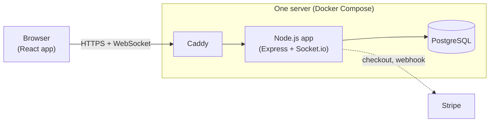
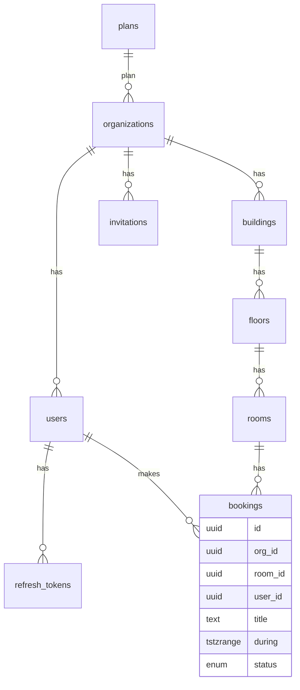
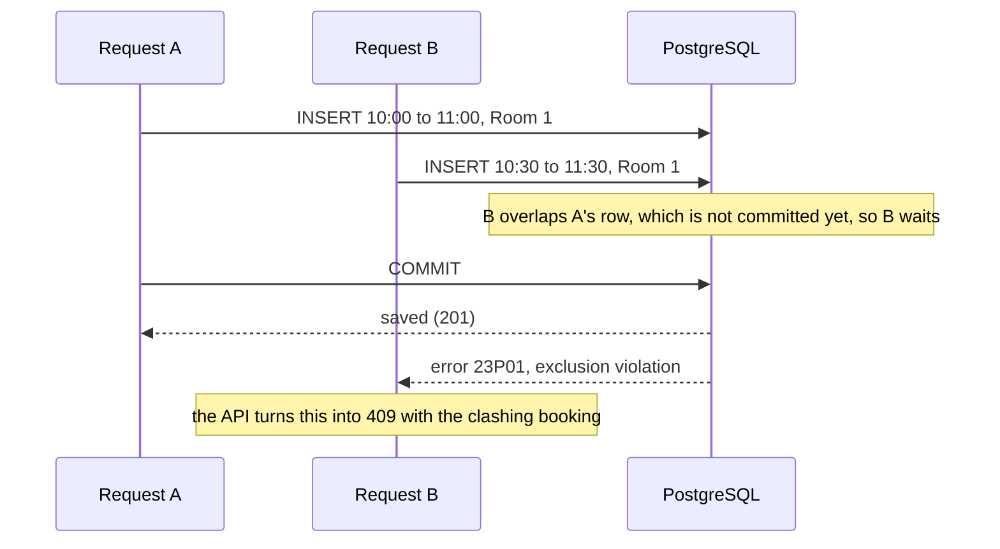
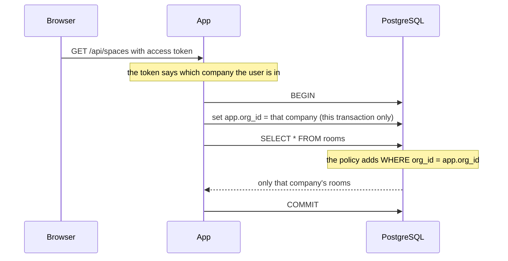

# How Roomly is built

Roomly is a meeting-room booking app that many companies can share. This page explains the parts that matter: the database tables, how a booking is checked, how companies are kept apart, how sign-in works, live updates, billing, and how it is deployed.

## 1. The big picture



- **Browser:** a React single-page app. It calls the API with `fetch` and keeps one WebSocket open for live updates.
- **Caddy:** gets the HTTPS certificate and passes every request to the app.
- **App:** one Node.js process. It serves the built web app, the JSON API under `/api`, and Socket.io.
- **PostgreSQL:** stores everything and enforces the two most important rules itself: no overlapping bookings, and no reading another company's data.

The code is one repository with three packages: `apps/api`, `apps/web`, and `packages/shared` (Zod schemas and types used by both, so the browser and the server agree on the shape of every request).

## 2. Database tables



- A **user** belongs to exactly one **organization** (company) and is either an `admin` or an `employee`.
- A company has **buildings**, which have **floors**, which have **rooms**. Each building has a time zone.
- A **booking** stores its time as one column, `during`, of type `tstzrange` (a start and an end together).
- **plans** holds Free, Pro and Enterprise with their room limits (3, 25, unlimited).

Every table below `organizations` carries an `org_id` column.

## 3. How double-booking is prevented

The usual approach is: check whether the room is free, then insert the booking. That has a gap. Two requests can both check at the same moment, both see "free", and both insert.

Roomly lets the database refuse the second one instead:

```sql
CONSTRAINT bookings_no_overlap
  EXCLUDE USING gist (room_id WITH =, during WITH &&)
  WHERE (status = 'confirmed')
```

In words: no two confirmed bookings may have the same `room_id` and overlapping (`&&`) time ranges. It works like a `UNIQUE` constraint, but for "overlaps" instead of "equals".



Details worth knowing:

- **Half-open ranges.** Bookings are stored as `[start, end)`: the start is included, the end is not. So 10:00 to 11:00 and 11:00 to 12:00 do not overlap, and back-to-back meetings work.
- **Cancelling frees the slot.** The constraint only covers `status = 'confirmed'`. Cancelled bookings stay in the table as history but no longer block anything.
- **Moving a booking** is an `UPDATE` of `during`, so the same constraint checks it.
- **One writer per room.** The constraint alone is enough for correctness, but when I fired 50 overlapping inserts at once, they sometimes all ended up waiting on each other, and Postgres cleared that up as a deadlock one transaction per second. So a small trigger locks the room's row before a booking is inserted or moved. Requests for the same room now queue up and are answered one by one; other rooms are not affected. As a safety net, the API also retries a transaction that Postgres aborts as a deadlock (`apps/api/src/db/retry.ts`).
- **A CHECK constraint** also rejects ranges that are empty, open-ended, or longer than 12 hours.

The tests prove this (`apps/api/test/db/booking-concurrency.test.ts`): 50 requests for the same slot at the same instant give exactly one success and 49 conflicts. A second test does the naive check-then-insert on a table without the constraint and shows the room getting booked 10 times.

## 4. How companies are kept apart

Rooms and bookings from all companies live in the same tables. Two things stop company A from touching company B's rows.

**Row-level security.** `buildings`, `floors`, `rooms` and `bookings` have this policy:

```sql
CREATE POLICY tenant_isolation ON bookings
  USING (org_id = current_org_id())
  WITH CHECK (org_id = current_org_id());
```

Every request runs inside one transaction that starts by saying which company it is for:



So even a query with no `WHERE` clause returns only the caller's rows. If the company is not set at all, the tables look empty. The setting lasts for one transaction only, so it cannot leak to the next request on the same pooled connection. The app connects as a normal database role (`roomly_app`), not as the owner, because Postgres skips row-level security for table owners.

**Composite foreign keys.** A booking points at its room with `(room_id, org_id)`, not just `room_id`. Without that, company A could insert a booking labelled with its own `org_id` but pointing at company B's room. The foreign key makes that impossible.

`organizations`, `users`, `invitations` and `refresh_tokens` are not under row-level security, because login has to find a user by email before it knows which company they belong to. Queries on those tables filter by `org_id` in code.

## 5. Sign-in

- Passwords are hashed with argon2id.
- Logging in returns two things:
  - an **access token**: a JWT that lasts 15 minutes, holding the user id, company id and role. The browser keeps it in memory only and sends it in the `Authorization` header.
  - a **refresh token**: a random string in an `httpOnly`, `SameSite=Strict` cookie that lasts 30 days. JavaScript cannot read it. Only its SHA-256 hash is stored in the database.
- When the access token expires, the browser calls `/api/auth/refresh`. The server deletes the old refresh token row and issues a new pair, so each refresh token works once.
- Logging out deletes the refresh token. Deactivating a user deletes all of theirs.
- New colleagues join through an invitation link created by an admin. The link holds a random token; the database stores only its hash.
- Login, signup and refresh are limited to 20 attempts per minute per IP address.
- Admin-only routes check the role from the access token.

## 6. Live updates

When a booking is created, changed or cancelled, the app sends a small Socket.io message to everyone looking at that building. The message only says "something changed". Each browser then re-reads the schedule through the normal API, so the same permission checks apply and there is one code path for loading data.

- The socket connects with the access token; no valid token, no connection.
- A browser asks to watch a building. The server looks the building up under row-level security first, so another company's building cannot be watched.
- The message is sent after the transaction commits, never for a rejected booking.

## 7. Plans and billing

The Free plan allows 3 rooms, Pro 25, Enterprise unlimited. Adding a room locks the company's row, counts its active rooms and compares with the plan's limit, so two simultaneous requests cannot both squeeze past the limit.

Upgrading uses Stripe Checkout:

1. An admin clicks Upgrade. The server creates a Checkout session with the company id and plan in its metadata, and sends the browser to Stripe's page.
2. After payment, Stripe calls `/api/webhooks/stripe`. The server verifies the signature, then sets the company's plan. The plan is never changed by the browser coming back from Stripe.
3. If the subscription is cancelled later, another webhook event puts the company back on Free.

Without Stripe keys the billing page still works and says that upgrades are switched off.

## 8. API

| Method and path | What it does | Who |
|---|---|---|
| `POST /api/auth/signup` | Create a company and its first admin | anyone |
| `POST /api/auth/login`, `/refresh`, `/logout` | Session handling | anyone |
| `GET /api/auth/invitations/:token`, `POST /api/auth/invitations/accept` | Join through an invitation | anyone with the link |
| `GET /api/me` | Current user and company | signed in |
| `GET /api/spaces`, `GET /api/plan-usage` | Buildings, floors, rooms; room count against the plan | signed in |
| `POST/PATCH/DELETE` on `/api/buildings`, `/floors`, `/rooms` | Manage spaces | admin |
| `GET /api/buildings/:id/schedule?date=` | All rooms and bookings for one day | signed in |
| `GET /api/bookings/mine` | My bookings | signed in |
| `POST /api/bookings` | Book a room (409 if taken) | signed in |
| `PATCH/DELETE /api/bookings/:id` | Change or cancel | the organizer, or an admin |
| `GET/POST/DELETE /api/invitations` | Invite colleagues | admin |
| `GET /api/members`, `PATCH /api/members/:id` | Change roles, deactivate | admin |
| `GET /api/billing`, `POST /api/billing/checkout` | Plan and upgrade | admin |
| `POST /api/webhooks/stripe` | Stripe events | Stripe (signed) |

Errors always look like `{ "error": { "code": "BOOKING_CONFLICT", "message": "...", "details": ... } }`.

## 9. Tests

`npm test` runs about 45 tests with Vitest against a real PostgreSQL (a throwaway database is created for each run).

- `test/db`: the overlap constraint, simultaneous requests, row-level security and the composite foreign key, using plain SQL so they show what the database guarantees by itself.
- `test/api`: sign-in, invitations, roles, spaces and the room limit, bookings, live updates over a real socket, and the Stripe webhook with locally signed events.

GitHub Actions runs the type check, the tests and the build on every push.

## 10. Deployment

The live demo runs on one small AWS EC2 server (ARM, Mumbai) with Docker Compose. `deploy/docker-compose.yml` starts three containers:

| Container | Job |
|---|---|
| `caddy` | Listens on ports 80 and 443, gets a Let's Encrypt certificate for the hostname, forwards to the app |
| `app` | The Node.js app. On start it applies new migrations and adds the demo companies if the database is empty |
| `postgres` | The database, with its data in a Docker volume |

The hostname is a free DuckDNS name pointing at the server's fixed IP address.

To release a new version:

1. Push to `main`. GitHub Actions runs the tests and builds the Docker image, then publishes it to GitHub's container registry.
2. Run `deploy/deploy.sh`. It tells the server to pull the new image and restart the containers.

To set up a new server: install Docker, create `/opt/roomly/.env` from `deploy/.env.example`, point a hostname at the server, and run `deploy/deploy.sh`.

## 11. What I left out on purpose

- **Recurring bookings.** Each booking is a single time range.
- **A user in several companies.** One email belongs to one company.
- **More than one app server.** Live updates are sent from the process that handled the request, which is enough for a single server. Running several would need a shared message channel between them (for example Redis).
- **Backups and monitoring.** This is a demo with made-up data.
