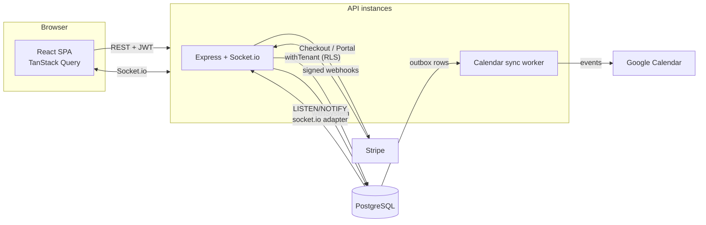

# Roomly: multi-tenant meeting-room booking

A SaaS product for booking meeting rooms, in the style of Robin and Condeco. A company signs up, its admins model their buildings, floors and rooms, and employees book rooms on a live calendar. Many companies share one deployment with fully isolated data. Each company pays for a plan through Stripe, and bookings appear on each employee's Google Calendar.

**Stack:** TypeScript end to end. Express 5, PostgreSQL 17, Kysely, Socket.io, React 19 with Vite, TanStack Query, Tailwind CSS, Stripe, Google Calendar API. **107 tests** run against a real Postgres.



---

## 1. No double bookings: enforced by the database

The core problem: two people click "Book" on the same room for overlapping times at the same moment. The naive approach is to query whether the slot is free and insert if it is. That is a race: both transactions run the check before either inserts, both see a free slot, and both insert.

Roomly doesn't check first at all. A booking stores its time as a **`tstzrange`**, and an **exclusion constraint** forbids overlaps:

```sql
CREATE EXTENSION btree_gist;   -- lets a GiST index do "=" on uuid

CREATE TABLE bookings (
  ...
  room_id uuid NOT NULL,
  during  tstzrange NOT NULL,              -- half-open: [start, end)
  status  booking_status NOT NULL DEFAULT 'confirmed',
  CONSTRAINT bookings_no_overlap
    EXCLUDE USING gist (room_id WITH =, during WITH &&)
    WHERE (status = 'confirmed')
);
```

This reads: *no two confirmed rows may have the same room and overlapping time ranges.*

- **Half-open ranges** `[10:00, 11:00)` and `[11:00, 12:00)` don't overlap, so back-to-back meetings work. A `CHECK` constraint rejects any other bound style, empty ranges, bookings over 12 hours, and sub-minute times.
- **Cancelling** sets `status = 'cancelled'`. That takes the row out of the partial constraint, which frees the slot, and the history row stays.
- **Race safety.** The constraint is enforced through its index at write time, the same way `UNIQUE` is. If two transactions insert overlapping bookings concurrently, the second waits for the first. If the first commits, the second fails with SQLSTATE `23P01`; if the first rolls back, the second succeeds. This works at the default READ COMMITTED level, with no `SELECT … FOR UPDATE` and no SERIALIZABLE.
- **API behaviour.** `POST /bookings` simply inserts. A `23P01` becomes **409 `BOOKING_CONFLICT`**, with the bookings that are in the way.

**A problem the tests found (migration 003).** The exclusion check runs *after* a row's index entry is written. When dozens of overlapping inserts arrive at the same instant, two transactions can each find the other's uncommitted entry and wait for each other. Postgres resolves the cycle after `deadlock_timeout` (1 s) by aborting one with `40P01`. Correctness was never at risk, but under a burst this means a chain of one-second stalls. A `BEFORE INSERT/UPDATE` trigger now takes a per-room transaction advisory lock before the row is written, so writers to the same room queue up instead of deadlocking. The constraint still decides what is allowed; the lock only makes contention fail fast. A retry wrapper for `40P01`/`40001` remains as a safety net.

**Proof in the tests** ([booking-concurrency.test.ts](apps/api/test/db/booking-concurrency.test.ts)):

| Test | Result |
|---|---|
| 50 connections insert the same slot at once (released together by a barrier) | exactly 1 succeeds, 49 get `23P01` |
| 60 random overlapping bookings at once across 3 rooms | zero overlaps stored, zero deadlock retries needed |
| Second writer while the first is uncommitted | blocks, then fails if the first commits and succeeds if it rolls back |
| The naive check-then-insert on an unconstrained table | the room gets booked 10 times |
| 20 simultaneous `POST /api/bookings` (HTTP level) | one `201`, nineteen `409`s |

The same "count, then act" race appears twice more, where a constraint *can't* express the rule. There, a row lock does the job:
- **Plan room cap.** Two admins adding a room at 2 of 3 could both pass the count. The org row is locked (`SELECT … FOR UPDATE`) before counting.
- **At least one active admin.** Two admins demoting each other at once. Same lock pattern.

Both have concurrency tests.

## 2. Multi-tenancy, enforced by the data layer

Every tenant table carries `org_id`, and isolation doesn't depend on remembering a `WHERE` clause:

- **Row-Level Security.** Each request runs in a transaction that sets `set_config('app.org_id', <from the JWT>, true)`. Policies compare `org_id` to that value. The setting is transaction-local, so it can't leak between requests sharing a pooled connection. With no org set, every table reads as empty (fails closed).
- **Composite foreign keys.** Children reference parents by `(id, org_id)`: floor → building, room → floor, booking → room and booker. FK checks bypass RLS, so without this a tenant could reference another tenant's room by UUID, and a `23P01` conflict would leak that room's calendar.
- **Two least-privilege roles.** Neither is a superuser or has `BYPASSRLS`.
  - `roomly_app` serves all tenant traffic. It has no `DELETE` on bookings (cancellation is a status change), no access to refresh tokens, and can't update `organizations.plan_id`.
  - `roomly_system` handles the pre-tenant paths (signup, login, refresh, invitations, Stripe webhooks, the calendar worker) through explicitly named `system_access` policies (migration 007). This also works on AWS RDS, where `BYPASSRLS` can't be granted.
- The API returns **404, not 403**, for other tenants' ids, so it doesn't reveal that they exist.

Tests: [tenancy.test.ts](apps/api/test/db/tenancy.test.ts) runs directly as the app role, plus a cross-tenant case in every API test file.

## 3. Authentication (built from scratch)

- Passwords hashed with **argon2id**. Unknown emails still run a dummy verify, so timing doesn't reveal which accounts exist.
- **Access token:** 15-minute HS256 JWT holding `{user, org, role}`, kept in memory by the SPA.
- **Refresh token:** opaque random value, stored only as a SHA-256 hash, in an `httpOnly; SameSite=Strict; Path=/api/auth` cookie. It is **rotated on every use**, with **reuse detection**: presenting an already-rotated token revokes the whole token family, because either the user or an attacker holds a stolen copy. The revocation is committed *before* the error is returned.
- The SPA serialises refreshes (a shared promise within a tab, the Web Locks API across tabs), so legitimate concurrent refreshes never look like theft.
- **Invite-only onboarding.** Invite links are one-time and expiring, and only their hash is stored.
- Roles are `admin` and `employee`, taken from the signed token and never from the request body.

## 4. Real-time calendars

- Socket.io with the access token checked at the **handshake**. Sockets are **dropped when the token expires**; the client refreshes and reconnects.
- A client **subscribes** to a room or building. The server checks the id through RLS before joining the channel, so knowing a UUID isn't enough.
- A booking change is published **after its transaction commits** and fanned out to the room channel, the building channel and the organizer's personal channel. The message is a **refetch hint**: clients re-read through the normal permission-checked API. Clients also refetch on every reconnect, so nothing missed while offline stays stale.
- **Presence:** "Priya is viewing" avatars.
- **Horizontal scaling.** The Socket.io **Postgres adapter** relays broadcasts between API instances over `LISTEN/NOTIFY`, so no Redis is needed. A test runs two server instances and checks delivery across them.

## 5. Billing (Stripe, test mode)

- Plans: **Free** (3 rooms), **Pro** (25 rooms), **Enterprise** (unlimited). Limits live in a `plans` table.
- Upgrades go through Stripe Checkout, and plan changes, card updates and cancellation through the Stripe Customer Portal. Only admins see billing.
- **Only the webhook changes the plan**, never the checkout redirect, because only Stripe knows whether payment succeeded. The webhook handler is:
  - **authentic:** HMAC signature verified over the raw body;
  - **idempotent:** the event id is inserted in the same transaction as its effects, so a redelivery is a no-op and a failure rolls back and gets retried;
  - **order-tolerant:** events older than the last one applied are ignored, and the end of an old, replaced subscription can't downgrade the current one.
- `past_due` keeps the plan as a grace period. `unpaid` or canceled drops to Free. After a downgrade, existing rooms keep working, but no rooms can be added.
- Tested offline with locally signed events and a stubbed gateway.

## 6. Google Calendar sync (transactional outbox)

- Per-user OAuth (authorization code, offline access). `state` is a signed JWT naming the user, and an `httpOnly` nonce cookie binds it to the browser that started the flow. Refresh tokens are encrypted at rest with **AES-256-GCM**, and the tenant DB role can't even select that column.
- An `AFTER` **trigger on `bookings`** writes sync jobs into `calendar_sync_outbox` in the same transaction. So *every* write path enqueues a job (including cancellations cascaded from deactivating a user), and a rolled-back booking leaves nothing behind.
- **The worker:**
  - claims jobs with a lease and `FOR UPDATE SKIP LOCKED`, so several workers can run safely (tested);
  - processes one booking's jobs in order;
  - always syncs the booking's *current* state;
  - uses **deterministic Google event ids** derived from the booking UUID, so retries can't create duplicates;
  - backs off exponentially and forgets connections the user revoked.

## Running it locally

Requirements: Node 20+. Docker is **not** required: `embedded-postgres` runs a real PostgreSQL 17 from `node_modules`. Alternatively, `docker compose up -d` starts one on the same port.

```bash
npm install
npm run db:reset          # create roles + database, migrate, seed two demo companies
npm run db:start          # keep Postgres running (separate terminal)
npm run dev:api           # http://localhost:4000
npm run dev:web           # http://localhost:5173
```

Demo accounts (password `Password123!`). The two companies are in different time zones, so the local-time handling is visible:

| Company | Plan | Admin | Employee |
|---|---|---|---|
| Acme Analytics (Bengaluru, Asia/Kolkata) | Pro | admin@acme.test | rahul@acme.test, ananya@acme.test |
| Northwind Labs (London, Europe/London) | Free (3/3 rooms) | admin@northwind.test | emma@northwind.test |

To see live updates, open the same building in two browsers, one signed in as Rahul and one as Ananya.

**Stripe and Google** are optional. Without keys, their pages explain what's missing. See `.env.example` for the variables. For webhooks locally: `stripe listen --forward-to localhost:5173/api/webhooks/stripe`.

```bash
npm test                  # 107 tests; boots Postgres if needed, uses a throwaway database
npm run typecheck
npm run build             # API bundle (apps/api/dist) + static SPA (apps/web/dist)
```

## Project layout

```
db/migrations/          001 schema · 002 RLS · 003 per-room write lock · 004 billing
                        005 calendar outbox · 006 socket.io adapter · 007 system-role policies
apps/api/src/
  db/                   withTenant / withSystem, retry on 40P01, Kysely types, migrate CLI
  auth/                 passwords, JWT + refresh rotation, invitations, middleware
  spaces/               buildings/floors/rooms, plan room cap
  bookings/             booking API, schedules, availability
  realtime/             post-commit event bus, Socket.io server
  billing/              Stripe gateway, checkout/portal, webhook
  integrations/         Google OAuth, token encryption, outbox worker
apps/api/test/          db/ (constraint, concurrency, RLS) and api/ (HTTP + sockets)
apps/web/src/           React SPA: timeline, room calendar, admin, billing, settings
packages/shared/        Zod schemas + types shared by API and web
```

## Deployment

See [docs/DEPLOYMENT.md](docs/DEPLOYMENT.md): AWS with ECS Fargate for the API, RDS PostgreSQL, and S3 + CloudFront for the SPA.
