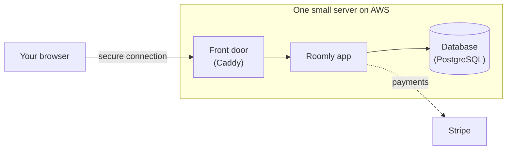

# Roomly: meeting-room booking for companies

Roomly lets a company's employees book meeting rooms without ever double-booking one. Many companies can use the same website, and each company only ever sees its own rooms and bookings.

**Try the live demo:** <https://roomly-prashant.duckdns.org>

On the sign-in page, click one of the demo buttons (for example **Acme employee**), then **Sign in**. The password for every demo account is `Password123!`. It only holds made-up data, so feel free to click around.

---

## What you can do with it

**As an employee**
- See all rooms in your office on one timeline, with what's free and what's taken.
- Click a free slot to book it. Change or cancel your booking later.
- Watch the calendar update by itself when a colleague books something. No refresh needed.

**As a company admin**
- Set up your offices: buildings, floors and rooms (how many seats, what equipment).
- Invite colleagues with a link, and decide who else is an admin.
- Choose a plan. The free plan allows 3 rooms; paid plans allow more.

## See the live updates in action

1. Open the demo in two browser windows (use a private/incognito window for the second).
2. Sign in as **Acme employee** in one and **Acme admin** in the other.
3. Book a room in one window. It appears in the other window within a second.

---

## How it works


```mermaid
flowchart LR
  B["Your browser"] -- "secure connection" --> C["Front door<br/>(Caddy)"]
  subgraph S["One small server on AWS"]
    C --> A["Roomly app"]
    A --> D[("Database<br/>(PostgreSQL)")]
  end
  A -. "payments" .-> P["Stripe"]
```

- **Your browser** talks to Roomly over a secure (padlock) connection. That same connection carries the instant updates.
- **The front door** makes the connection secure and passes requests on to the app.
- **The Roomly app** shows the website and handles sign-in, bookings and the rules about who may do what.
- **The database** stores everything. It is also the final judge on bookings (see below).
- **Stripe** takes care of payments, so Roomly never sees card numbers.

The front door, the app and the database all run on a single small server in Amazon's cloud (AWS).

---

## What makes it well built

**Two people can never book the same room at the same time.**
Imagine two colleagues clicking "Book" for the same room at the same instant. Many booking systems check "is it free?" and then save the booking, and in that tiny gap both people can get through. In Roomly the database itself refuses any booking that overlaps an existing one for the same room. One person gets the room and the other is told who has it. This was tested by firing 50 booking requests at once: exactly one succeeds, every time.

**Each company's data is walled off.**
For rooms and bookings, the database checks every single read and write and only lets a company see its own information. This doesn't depend on the app's code getting it right each time, so a programming mistake can't leak one company's data to another.

**Sign-in is handled carefully.**
Passwords are stored in scrambled form. Sessions use short-lived passes that are replaced each time they're used. Repeated wrong passwords from one place are blocked for a while.

**It's tested.**
About 45 automated tests run on every change, against a real database. They cover the booking rule, simultaneous requests, company isolation and sign-in.

---

## For engineers

| | |
|---|---|
| Language | TypeScript everywhere |
| Backend | Node.js, Express 5, Socket.io |
| Database | PostgreSQL 17 (range types, exclusion constraints, row-level security) |
| Frontend | React 19, Vite, TanStack Query, Tailwind CSS |
| Payments | Stripe Checkout and a webhook |
| Hosting | One AWS EC2 server running Docker Compose, Caddy for HTTPS, GitHub Actions for tests |

[DESIGN.md](DESIGN.md) explains how it is built: the database tables, how a booking is checked, how companies are kept apart, how sign-in works, and how it is deployed.

### Run it on your own computer

You need Node.js 20 or newer. Docker is not required; a real PostgreSQL is started for you.

```bash
npm install
```
```bash
npm run db:reset
```
```bash
npm run db:start
```
```bash
npm run dev:api
```
```bash
npm run dev:web
```

Run `db:start`, `dev:api` and `dev:web` in three separate terminals, then open <http://localhost:5173>. `db:reset` creates the database with the two demo companies.

To run the tests:

```bash
npm test
```

### Where things are

| Folder | What's in it |
|---|---|
| `apps/api` | The server: sign-in, bookings, live updates, billing, and its tests |
| `apps/web` | The website people use |
| `packages/shared` | Rules and data shapes shared by the server and the website |
| `db/migrations` | The database structure: tables, the no-overlap rule, row-level security |
| `deploy` | What runs on the live server, and the script that updates it |
