# Roomly — High-Level Design (HLD)

| | |
|---|---|
| **System** | Roomly: multi-tenant meeting-room booking SaaS |
| **Author** | Prashant |
| **Version** | 1.0 (matches repository state after Phase 8) |
| **Status** | Implemented; 107 automated tests; CI green on GitHub |
| **Companion** | [LLD.md](LLD.md): low-level design (schemas, algorithms, sequences, APIs) |

---

## Contents

1. [Purpose and scope](#1-purpose-and-scope)
2. [Product overview](#2-product-overview)
3. [Requirements](#3-requirements)
4. [Assumptions and constraints](#4-assumptions-and-constraints)
5. [System context](#5-system-context)
6. [Architecture](#6-architecture)
7. [Technology choices](#7-technology-choices)
8. [Domain model](#8-domain-model)
9. [Multi-tenancy](#9-multi-tenancy)
10. [Key user journeys](#10-key-user-journeys)
11. [Booking correctness: the core design decision](#11-booking-correctness-the-core-design-decision)
12. [Real-time updates](#12-real-time-updates)
13. [Synchronous vs asynchronous boundaries](#13-synchronous-vs-asynchronous-boundaries)
14. [Security](#14-security)
15. [Module map](#15-module-map)
16. [Deployment](#16-deployment)
17. [Scalability and availability](#17-scalability-and-availability)
18. [CI/CD](#18-cicd)
19. [Operations and observability](#19-operations-and-observability)
20. [Trade-offs, risks and future work](#20-trade-offs-risks-and-future-work)
21. [Glossary](#21-glossary)

---

## 1. Purpose and scope

This document describes the overall structure of Roomly: what the system does, the major components, how they interact, which technologies were chosen and why, and how the system is deployed and scaled. It is written for reviewers, interviewers and future contributors who need the big picture before reading code.

Implementation detail (table columns, SQL, algorithms, request/response contracts, state machines) lives in the [Low-Level Design](LLD.md).

**In scope:** web application (SPA + API), PostgreSQL data model, authentication, tenant isolation, booking engine, real-time updates, Stripe subscription billing, Google Calendar sync, CI, and the AWS deployment design.

**Out of scope (v1):** recurring bookings, users in multiple organizations, SSO/SAML, email delivery, native mobile apps, check-in/no-show detection, analytics dashboards.

---

## 2. Product overview

Companies with offices need a fair, conflict-free way for employees to reserve meeting rooms, similar to products like Robin or Condeco. Roomly is sold as **SaaS**: each company (an *organization*, or *tenant*) signs up, models its offices, invites staff and pays a monthly subscription. All companies share one deployment, but no company can ever see or affect another's data.

**Personas**

| Persona | Goals | Sees billing? |
|---|---|---|
| **Organization admin** | Create the org, model buildings → floors → rooms, invite and manage staff, choose a plan | Yes |
| **Employee** | Find a free room that fits, book it, change or cancel it, see it on their Google Calendar | No |

**Headline capabilities**

- Rooms × hours **timeline** per building, in the building's local time zone.
- Per-room **week calendar** with drag-to-book.
- **Guaranteed no double bookings**, even when many people click at once.
- **Live updates**: a booking by anyone appears on everyone's screen immediately, with presence ("Priya is viewing").
- **Plans** (Free / Pro / Enterprise) enforced by room count, paid through Stripe.
- **Google Calendar sync** for each employee's own bookings.

---

## 3. Requirements

### 3.1 Functional

| ID | Requirement |
|---|---|
| F1 | A visitor can sign up a new organization and becomes its first admin. |
| F2 | Admins can invite people by email with a role (admin / employee). Invitations are one-time links that expire after 7 days. |
| F3 | Admins can create, rename and delete buildings (with an IANA time zone), floors (with a level) and rooms (capacity, amenities), and can deactivate or reactivate rooms. |
| F4 | Admins can change members' roles and deactivate members. An organization always keeps at least one active admin. |
| F5 | Any member can view a building's day schedule and a room's calendar, search availability, and see their own bookings. |
| F6 | Any member can book a room for a time range (≤ 12 h, whole minutes, not in the past, ≤ 180 days ahead). Overlapping bookings for the same room are impossible. |
| F7 | The organizer (or an admin) can retitle, reschedule or cancel a booking. Cancelled bookings remain as history. |
| F8 | Everyone viewing a room or building sees bookings appear, move or disappear without refreshing. |
| F9 | Admins can upgrade, downgrade or cancel through Stripe. The plan limits the number of active rooms. |
| F10 | A member can connect Google Calendar. Their bookings are then created, updated and removed on their calendar automatically. |

### 3.2 Non-functional

| Quality | Target / approach |
|---|---|
| **Correctness** | Double-booking prevention enforced by the database (exclusion constraint), proven under concurrency in tests. |
| **Isolation** | Tenant data isolated at the data layer (Row-Level Security + composite foreign keys), not just in application code. |
| **Security** | OWASP-aligned auth: argon2id, short-lived JWTs, rotating refresh tokens with reuse detection, httpOnly SameSite cookies, rate limiting, signed webhooks, encrypted third-party tokens. |
| **Latency** | Typical API calls take tens of ms locally; real-time updates propagate in under a second. |
| **Scalability** | Stateless API instances behind a load balancer; all coordination goes through PostgreSQL. |
| **Resilience** | External systems (Stripe, Google) never block or break a booking. Webhooks and sync jobs are idempotent and retried. |
| **Maintainability** | TypeScript end to end, schemas shared between client and server, SQL migrations as the source of truth, 107 automated tests, CI. |
| **Portability** | Runs locally without Docker (embedded Postgres), on Docker, and on AWS RDS (no superuser-only features). |

---

## 4. Assumptions and constraints

- **One organization per user.** A user's email is globally unique. This keeps tenant resolution trivial (the org comes from the user) and was a deliberate product decision.
- **Single (non-recurring) bookings** in v1. Recurrence could later expand a series into individual rows inside one transaction, and the same constraint would then protect every occurrence.
- **Stripe runs in test mode**, and the Google OAuth app in testing mode, for the portfolio deployment.
- **No email service.** Admins copy invitation links from the UI. A real deployment would plug in SES or Postmark.
- The development machine had **no Docker or WSL**, so local development uses embedded PostgreSQL binaries delivered through npm. Docker Compose is also supported.

---

## 5. System context

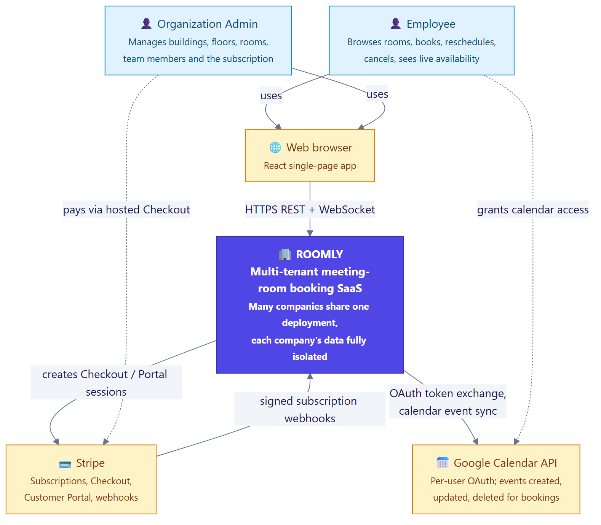

Roomly has two human actors and two external systems:

- **Stripe** owns billing truth. Roomly redirects admins to Stripe-hosted Checkout and the Customer Portal, and Stripe tells Roomly about subscription changes through **signed webhooks**. Roomly never handles card data.
- **Google Calendar**: each employee may grant Roomly permission (OAuth 2.0, `calendar.events` scope) to write events for their own bookings.

---

## 6. Architecture

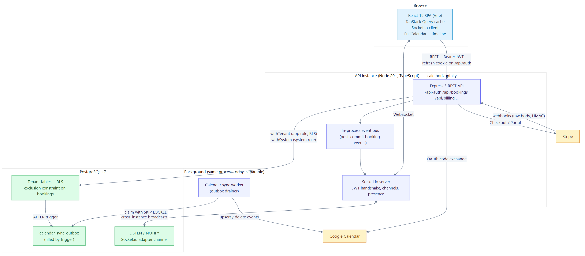

| Component | Responsibility |
|---|---|
| **React SPA** (Vite, TanStack Query, Tailwind) | All UI. Holds the access token in memory, caches server data, subscribes to live channels, renders times in the building's zone. |
| **Express REST API** | Authentication, validation (Zod), authorization (roles), and all business operations. Every tenant query goes through `withTenant`, which pins a transaction to one org so that RLS applies. |
| **Socket.io server** | Authenticated WebSocket connections, room/building/user channels, presence, and fan-out of booking changes. |
| **Event bus** | In-process, **post-commit** notifications from HTTP handlers to the socket layer. |
| **Calendar sync worker** | Drains the transactional outbox and calls the Google Calendar API with retries and backoff. |
| **PostgreSQL 17** | Source of truth and the enforcer of invariants: exclusion constraint, RLS, foreign keys, triggers. It also carries LISTEN/NOTIFY for the cross-instance socket adapter and the outbox queue. |
| **Stripe / Google** | External providers, always reached outside database transactions. |

The architecture is a **modular monolith**: one deployable API with clear internal modules (auth, spaces, bookings, billing, integrations, realtime). That fits the team size and scope. Modules only talk through function calls and the event bus, so the worker, for example, can later become its own service (see §17).

---

## 7. Technology choices

| Area | Choice | Why (and alternatives considered) |
|---|---|---|
| Language | **TypeScript** everywhere | One language; types and Zod schemas shared by client and server (`packages/shared`). |
| API | **Express 5** | Mature and well known. v5 handles rejected async handlers natively. |
| Database | **PostgreSQL 17** | Range types, **exclusion constraints**, **Row-Level Security**, advisory locks, `SKIP LOCKED`, LISTEN/NOTIFY. The core correctness features depend on it. DynamoDB can't express "no overlapping ranges". |
| DB access | **Kysely** (typed query builder) + hand-written SQL migrations | Prisma can't model `tstzrange` or exclusion constraints cleanly. With Kysely, raw SQL stays first-class and the DDL is explainable. |
| Real-time | **Socket.io** + **Postgres adapter** | Rooms/channels, reconnection and acks built in. The Postgres adapter scales across instances with no Redis. |
| Frontend | **React 19 + Vite** (SPA) | A login-only internal tool gets nothing from server-side rendering. A pure SPA on the same origin as the API keeps cookie auth simple. Next.js was considered and rejected for this reason. |
| Server state | **TanStack Query** | Caching, invalidation (used for live updates), retries. |
| Calendar UI | Custom timeline + **FullCalendar** (MIT parts) with the Luxon plugin | Time-zone-correct rendering. The premium resource-timeline view is replaced by a custom component. |
| Time | **Luxon** | Named-zone arithmetic and DST correctness in the browser. |
| Auth | **Own implementation** (argon2id, JWT via `jose`, rotating refresh tokens) | Portfolio goal: show auth engineering. Clerk/Auth0 would be faster in a real startup. |
| Payments | **Stripe** Checkout + Customer Portal + webhooks | Hosted UIs avoid PCI scope; webhooks are the source of truth. |
| Tests | **Vitest** + **Supertest** + real Postgres | Constraints, RLS and concurrency can't be proven against mocks. |
| Build | **esbuild** (API), **Vite** (web) | Fast, simple bundles; the API image ships a single bundled file. |

---

## 8. Domain model

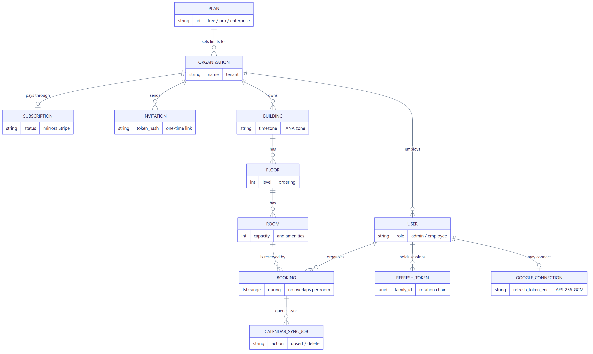

- **Organization**: the tenant. It has a **plan** (limits) and optionally a Stripe **subscription**.
- **User** belongs to exactly one organization and has a role (**admin** or **employee**).
- **Building** (with a time zone) → **Floor** (level) → **Room** (capacity, amenities, active flag).
- **Booking** holds room, organizer, title and a **time range** (`tstzrange`), with status confirmed or cancelled.
- **Invitation**: one-time, expiring onboarding link.
- **Refresh token**: server-side session record, grouped into rotation *families*.
- **Google connection**: an employee's encrypted Google refresh token.
- **Calendar sync job**: outbox entry describing work for the Google worker.

The full column-level schema is in [LLD §3](LLD.md#3-database-design).

---

## 9. Multi-tenancy

**Model:** shared database, shared schema, `org_id` column on every tenant-owned table. This is the most cost-efficient SaaS model, and it is safe only if isolation is enforced below the application. Roomly enforces it in five layers:

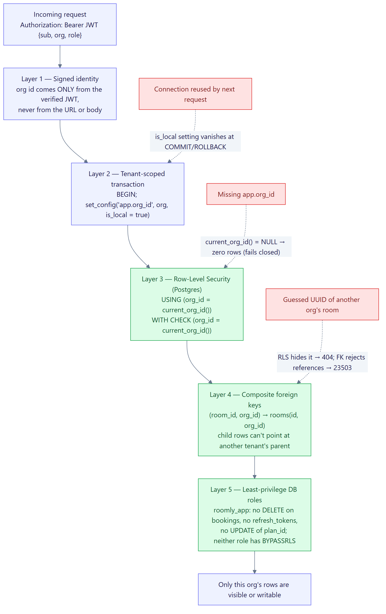

1. **Signed identity.** The org id comes only from the verified JWT.
2. **Tenant-scoped transaction.** `set_config('app.org_id', …, true)` is local to the transaction, so it can never leak to the next request on a pooled connection.
3. **Row-Level Security.** Postgres filters every read and checks every write. If no org is set, every table appears empty (fails closed).
4. **Composite foreign keys** `(id, org_id)`. Foreign-key checks bypass RLS, so without these a tenant could reference another tenant's room by UUID. That would allow cross-tenant bookings and leak calendars through conflict errors.
5. **Least-privilege roles.** The request role can't delete bookings, can't read refresh tokens, and can't change its own plan.

Cross-tenant ids return **404** (not 403), so the API doesn't reveal that the resource exists.

---

## 10. Key user journeys

### 10.1 Onboarding

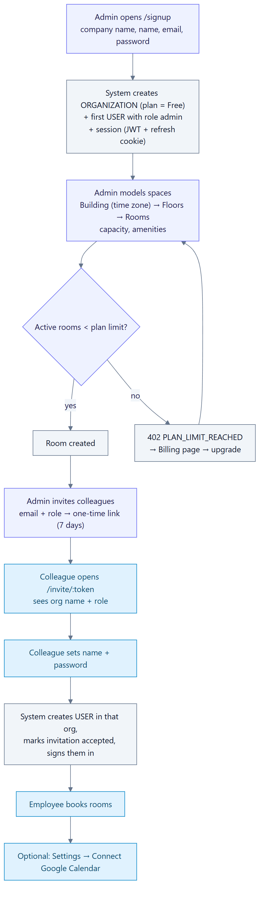

### 10.2 Booking

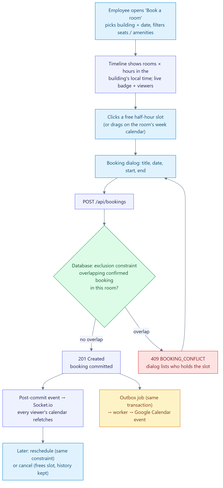

### 10.3 Billing

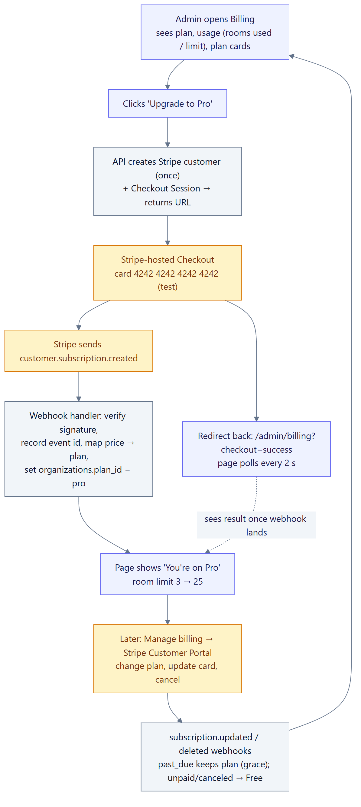

The plan changes **only when Stripe's webhook arrives**, never on the checkout redirect, because only Stripe knows whether the payment succeeded. The billing page polls briefly after returning from checkout.

---

## 11. Booking correctness: the core design decision

**Problem.** Two employees click "Book" for overlapping times in the same room at the same moment. The usual approach is to query whether the slot is free and insert if so. That is a race condition: both checks run before either insert, both see a free slot, and both bookings are saved.

**Decision.** Don't check first; let the database reject the conflict. Each booking stores its time as a `tstzrange` (half-open `[start, end)`), and an **exclusion constraint** forbids two *confirmed* bookings with the same room and overlapping ranges. The constraint is enforced atomically at write time through a GiST index, like `UNIQUE`. A concurrent second writer waits for the first and then either fails (`23P01` → HTTP 409) or succeeds if the first rolled back.

**Refinement found by testing.** Under bursts of simultaneous overlapping inserts, the constraint check can create wait cycles that Postgres resolves as deadlocks. That was always correct, but cost a one-second stall each time. A trigger now takes a **per-room advisory lock** before the row is written, so same-room writers queue. The constraint remains the guarantee; the lock only makes contention fail fast.

**Evidence:**
- 50 concurrent identical requests → exactly 1 success and 49 conflicts.
- 60 random concurrent bookings → zero overlaps and zero retries.
- The naive approach books the same room 10 times in the contrast test.
- 20 concurrent HTTP requests → one 201 and nineteen 409s.

Details and sequence diagrams: [LLD §5](LLD.md#5-booking-engine).

Two related invariants can't be expressed as constraints: **plan room caps** and **at least one active admin**. Both use the same idea implemented differently: lock the organization row (`SELECT … FOR UPDATE`), re-count, then act.

---

## 12. Real-time updates

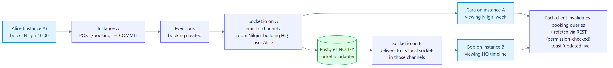

- The browser opens one Socket.io connection, authenticated with the access token at the handshake. It is disconnected when that token expires; the client refreshes and reconnects.
- A view subscribes to a **room** or **building** channel. The server checks visibility through RLS before joining. Each user is also in a personal channel.
- After a booking change commits, the API emits a small **refetch hint** to the room, building and organizer channels. Clients refetch through the normal REST API, so permissions and formatting are applied in exactly one place.
- **Presence** shows who else is viewing the same calendar.
- Across multiple API instances, broadcasts travel through **PostgreSQL LISTEN/NOTIFY** (Socket.io Postgres adapter).
- Clients also refetch on every reconnect, so an event missed while offline can't leave a stale screen.

---

## 13. Synchronous vs asynchronous boundaries

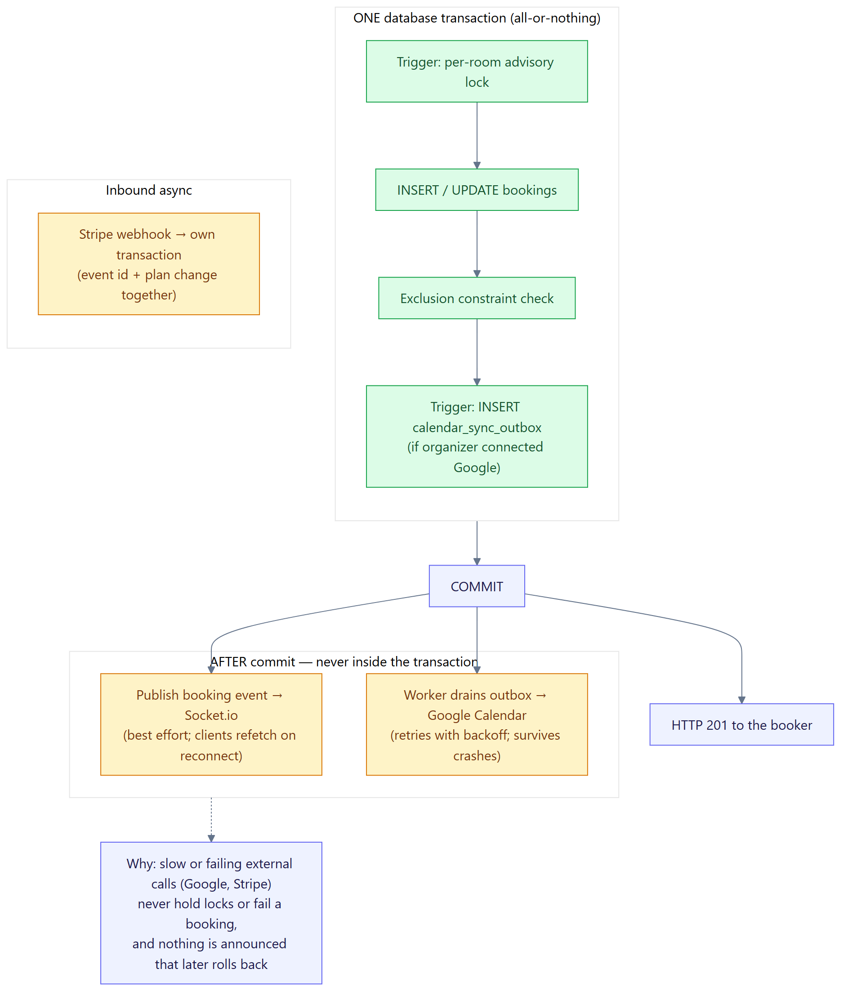

**Rule:** slow or unreliable work (network calls to Stripe or Google, WebSocket broadcasts) never happens inside a database transaction, and nothing is announced before it commits.

- **Google sync** uses the **transactional outbox** pattern. A database trigger enqueues a job in the same transaction as the booking change, and a worker processes it later with retries. A Google outage can't fail a booking, and a rolled-back booking leaves no job.
- **Socket events** are published after commit, on a best-effort basis (clients re-sync on reconnect).
- **Stripe webhooks** are processed in their own transaction, together with the event id, which makes them idempotent.

---

## 14. Security

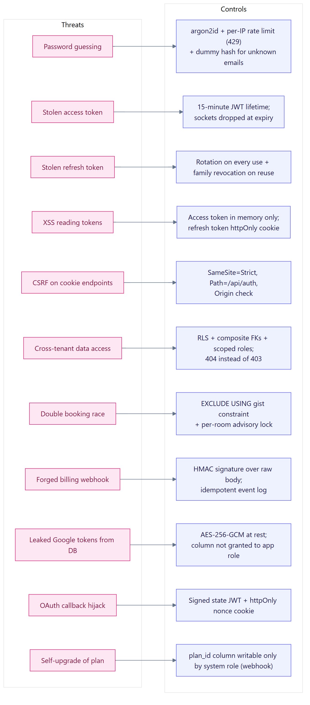

| Area | Design |
|---|---|
| Passwords | argon2id (19 MiB, t=2). Constant-work login: unknown emails still run a dummy verify. Per-IP rate limit on auth endpoints. |
| Sessions | 15-minute access JWT held in memory. Opaque refresh token in an `httpOnly; SameSite=Strict; Path=/api/auth` cookie, stored as a SHA-256 hash, **rotated on every use**, with **reuse detection** that revokes the whole family. |
| CSRF | SameSite=Strict, a path-scoped cookie, and an Origin check on cookie-authenticated endpoints. The API otherwise uses Bearer tokens, which aren't sent automatically. |
| Authorization | Role in the signed token (`requireAdmin`); ownership checks for bookings; tenant isolation in the database. |
| Webhooks | Stripe HMAC signature verified over the raw body; idempotent processing. |
| Third-party secrets | Google refresh tokens encrypted with AES-256-GCM. The encrypted column isn't even readable by the request role. |
| OAuth | Signed `state` (user identity) plus an httpOnly nonce cookie binding the flow to the browser that started it. |
| Transport and headers | HTTPS through CloudFront/ALB; `helmet` security headers; 100 KB body limit. |
| Secrets management | Environment variables from AWS Secrets Manager / SSM. The API refuses to start in production with development secrets. |

---

## 15. Module map

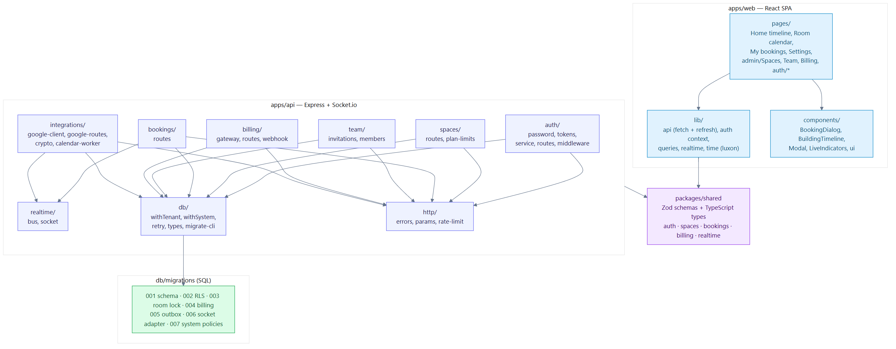

---

## 16. Deployment

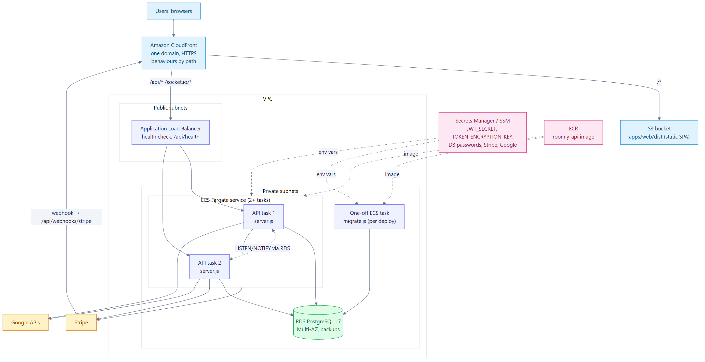

- **CloudFront** serves one domain: `/*` from **S3** (the static SPA), and `/api/*` plus `/socket.io/*` routed to an **ALB** in front of **ECS Fargate** tasks running the API image. One origin means the SameSite=Strict cookie works and no CORS is needed.
- **RDS PostgreSQL 17** sits in private subnets (Multi-AZ, automated backups).
- **Migrations** run once per deploy as a one-off ECS task (`migrate.js`) before the service rolls.
- Why not Lambda: Socket.io needs long-lived connections.

Step-by-step instructions are in [`docs/DEPLOYMENT.md`](../docs/DEPLOYMENT.md).

---

## 17. Scalability and availability

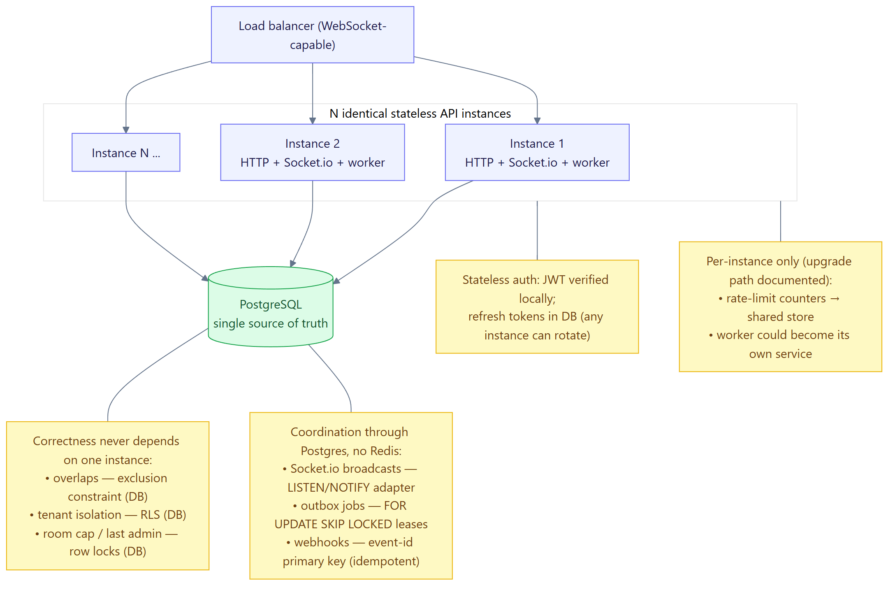

- API instances are **stateless**: JWTs are verified locally, and refresh tokens live in the database, so any instance can rotate one.
- Correctness never depends on which instance handles a request. The overlap constraint, RLS and row locks all live in Postgres.
- Cross-instance coordination also runs through Postgres (no Redis):
  - LISTEN/NOTIFY for sockets;
  - `FOR UPDATE SKIP LOCKED` leases for outbox workers;
  - primary-key idempotency for webhooks.
- **Known limits and upgrade path:**
  - Auth rate-limit counters are per instance; they need a shared store.
  - The worker can move to its own ECS service.
  - Beyond a single primary database: read replicas for schedule reads, or partitioning bookings by time.

---

## 18. CI/CD

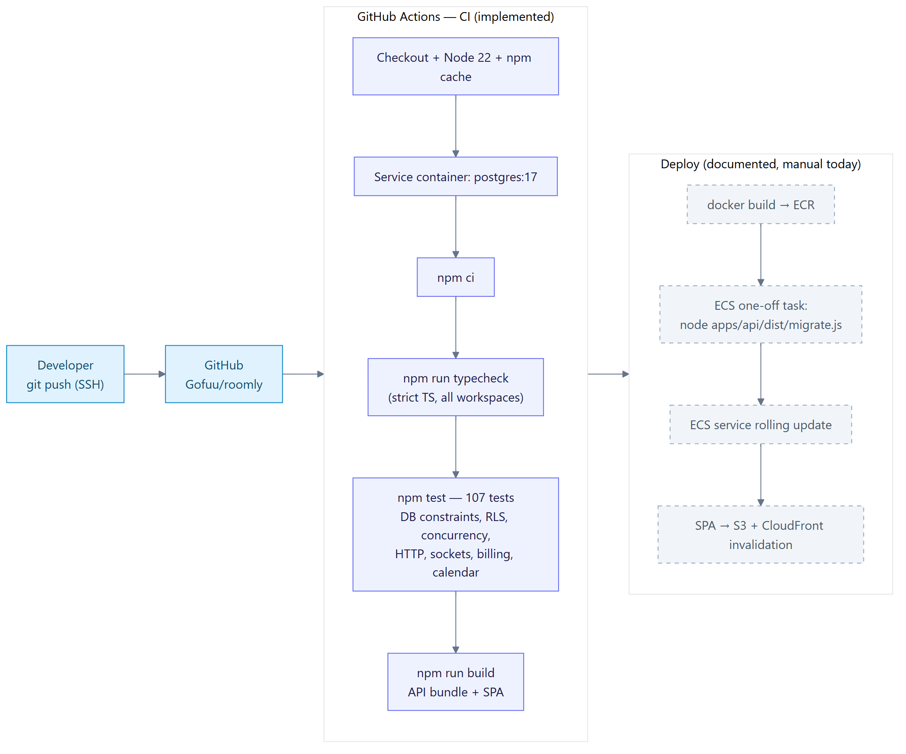

CI runs on every push and pull request (GitHub Actions): typecheck, all tests against a `postgres:17` service container, and the production build. Deployment is documented and manual today; automating it with GitHub Actions and OIDC to AWS is the natural next step.

---

## 19. Operations and observability

- **Health:** `GET /api/health` runs `SELECT 1` and returns 503 when the database is unreachable (used by ALB and Docker `HEALTHCHECK`).
- **Graceful shutdown:** SIGTERM stops the worker, closes sockets and the adapter, drains HTTP, then closes the pools.
- **Logs:** request log in development; errors logged server-side. Production messages are generic (`INTERNAL`) so internals don't leak.
- **Audit trail:** cancelled bookings and accepted or revoked invitations are kept. Refresh tokens record their rotation chain. `stripe_events` keeps every webhook id received.
- **Planned:**
  - structured JSON logs (pino) with request ids;
  - Sentry;
  - metrics (outbox queue depth, 409 rate, webhook failures);
  - RDS Performance Insights.

---

## 20. Trade-offs, risks and future work

| Decision | Trade-off accepted |
|---|---|
| Shared-schema multi-tenancy | Cheapest and simplest to run. It relies on RLS being correct, which is mitigated by tests that run as the real database role. |
| Custom auth | More code to own than Clerk/Auth0, in exchange for showing auth engineering. |
| Refetch-hint real-time messages | One extra REST round-trip per update, in exchange for a single place for permissions and formatting and no stale-cache bugs. |
| Per-room advisory lock | Bookings for one room are written serially, which is irrelevant at realistic volumes. |
| Access-token lifetime (15 min) | A deactivated user keeps API access for up to 15 minutes (refresh is refused immediately and sockets drop at expiry). A revocation list could close the gap. |
| Worker in the API process | Simple to run now; can be split out later without code changes. |

**Future work:**
- recurring bookings;
- check-in and auto-release of no-shows;
- SSO/SAML and SCIM;
- email notifications;
- seat-based pricing;
- analytics (utilisation per room);
- audit log UI;
- mobile-friendly kiosk view for room doors.

---

## 21. Glossary

| Term | Meaning |
|---|---|
| **Tenant / organization** | A customer company; the unit of data isolation. |
| **RLS** | PostgreSQL Row-Level Security: per-row filters enforced by the database. |
| **Exclusion constraint** | A Postgres constraint that rejects rows conflicting with existing rows under given operators (here: same room `=` and overlapping time `&&`). |
| **`tstzrange`** | A range of timestamps with time zone, here always half-open `[start, end)`. |
| **Outbox** | A table written in the same transaction as a business change, then processed asynchronously, which guarantees at-least-once side effects. |
| **Refresh-token family** | All refresh tokens descended from one login through rotation. |
| **SKIP LOCKED** | Postgres row-locking option that lets several workers claim different rows without waiting on each other. |
| **Advisory lock** | An application-defined lock in Postgres, keyed here by room, held until the transaction ends. |
