# Roomly — Low-Level Design (LLD)

| | |
|---|---|
| **System** | Roomly: multi-tenant meeting-room booking SaaS |
| **Author** | Prashant |
| **Version** | 1.0 (matches repository state after Phase 8) |
| **Companion** | [HLD.md](HLD.md): high-level design |

Every diagram below is generated from source in [`diagrams/lld/`](diagrams/lld) (`npm run design:render`).

---

## Contents

1. [Conventions](#1-conventions)
2. [Code structure](#2-code-structure)
3. [Database design](#3-database-design)
4. [Request handling](#4-request-handling)
5. [Booking engine](#5-booking-engine)
6. [Authentication and sessions](#6-authentication-and-sessions)
7. [Spaces, plan limits and team management](#7-spaces-plan-limits-and-team-management)
8. [Real-time layer](#8-real-time-layer)
9. [Billing (Stripe)](#9-billing-stripe)
10. [Google Calendar sync](#10-google-calendar-sync)
11. [Frontend](#11-frontend)
12. [API reference](#12-api-reference)
13. [Error catalogue](#13-error-catalogue)
14. [Configuration reference](#14-configuration-reference)
15. [Process lifecycle, migrations and tooling](#15-process-lifecycle-migrations-and-tooling)
16. [Testing](#16-testing)

---

## 1. Conventions

- **IDs:** UUID v4 (`gen_random_uuid()`), except `bigserial` for queue tables.
- **Time:** every instant is `timestamptz` and serialized as ISO-8601 UTC. The API accepts ISO strings with an explicit offset. Wall-clock times are always interpreted in the **building's** IANA zone.
- **Ranges:** bookings use half-open `[start, end)`, enforced by a CHECK constraint.
- **API style:** JSON over HTTPS under `/api`. Errors always have the shape `{ "error": { "code", "message", "details?" } }`.
- **DB access:** every tenant operation uses `withTenant(orgId, fn)`. Privileged, cross-tenant work uses `withSystem(fn)`. Nothing else talks to the database.
- **Validation:** Zod schemas in `packages/shared`, used by both the API (authoritative) and the web app.

---

## 2. Code structure

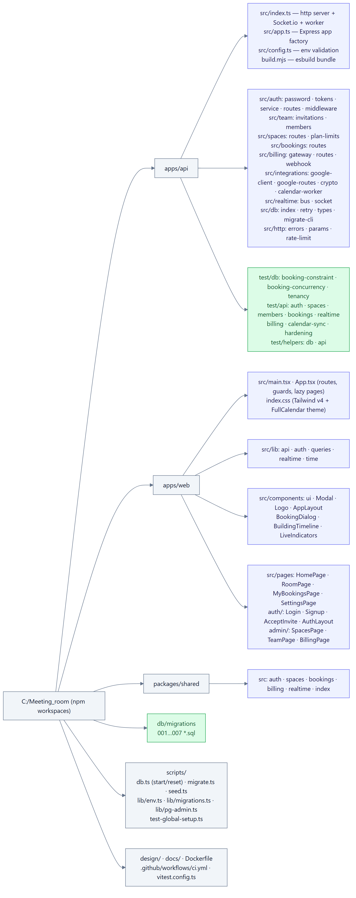

| Package | Purpose |
|---|---|
| `apps/api` | Express 5 + Socket.io server, calendar worker, tests. Bundled with esbuild into `dist/server.js` and `dist/migrate.js`. |
| `apps/web` | React 19 SPA built with Vite. Admin pages and the room calendar are lazy-loaded chunks. |
| `packages/shared` | Zod schemas and TypeScript contracts: auth, spaces, bookings, billing, realtime. |
| `db/migrations` | Ordered SQL files; the single source of truth for the schema. |
| `scripts` | Local database lifecycle (embedded Postgres), migration runner, seed, test global setup. |

---

## 3. Database design

### 3.1 Entity-relationship diagram

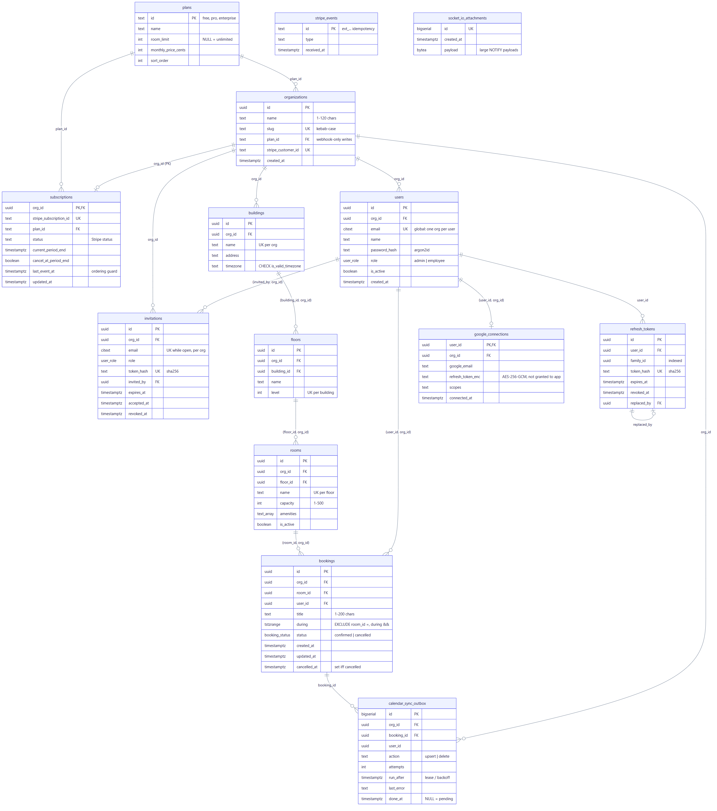

### 3.2 Tables

**`plans`**: reference data, seeded by migration 001.

| Column | Type | Notes |
|---|---|---|
| id | text PK | `free`, `pro`, `enterprise` |
| name | text | |
| room_limit | int NULL | 3 / 25 / NULL (unlimited); CHECK ≥ 0 |
| monthly_price_cents | int | 0 / 4900 / 19900 (display only; Stripe prices are authoritative) |
| sort_order | int | |

**`organizations`**: the tenant.

| Column | Type | Constraints |
|---|---|---|
| id | uuid PK | |
| name | text | 1–120 chars after trim |
| slug | text | UNIQUE, `^[a-z0-9]+(-[a-z0-9]+)*$` |
| plan_id | text | FK → plans, default `free`, **writable only by the system role** |
| stripe_customer_id | text NULL | UNIQUE |
| created_at | timestamptz | |

**`subscriptions`**: mirror of Stripe state, one per org.

| Column | Type | Constraints |
|---|---|---|
| org_id | uuid PK | FK → organizations ON DELETE CASCADE |
| stripe_subscription_id | text | UNIQUE |
| plan_id | text | FK → plans |
| status | text | Stripe status string |
| current_period_end | timestamptz NULL | from the subscription item |
| cancel_at_period_end | boolean | |
| last_event_at | timestamptz | default `-infinity`; out-of-order guard |
| updated_at | timestamptz | |

**`users`**

| Column | Type | Constraints |
|---|---|---|
| id | uuid PK | UNIQUE (id, org_id) |
| org_id | uuid | FK → organizations ON DELETE CASCADE; index `users_org` |
| email | citext | **UNIQUE (global)**, so one org per user |
| name | text | 1–120 |
| password_hash | text | argon2id PHC string |
| role | enum `user_role` | `admin` \| `employee` |
| is_active | boolean | |
| created_at | timestamptz | |

**`invitations`**

| Column | Type | Constraints |
|---|---|---|
| id | uuid PK | |
| org_id | uuid | FK → organizations |
| email | citext | partial UNIQUE (org_id, email) WHERE open |
| role | user_role | |
| token_hash | text | UNIQUE; SHA-256 hex of the emailed token |
| invited_by | uuid | FK (invited_by, org_id) → users(id, org_id) |
| expires_at / accepted_at / revoked_at | timestamptz | open = not accepted, not revoked, not expired |

**`refresh_tokens`**: no org_id and no RLS; the app role has no grant.

| Column | Type | Notes |
|---|---|---|
| id | uuid PK | |
| user_id | uuid | FK → users ON DELETE CASCADE |
| family_id | uuid | all tokens from one login; index `refresh_tokens_family` |
| token_hash | text | UNIQUE, SHA-256 |
| expires_at | timestamptz | 30 days |
| revoked_at | timestamptz NULL | set on rotation, logout, reuse or deactivation |
| replaced_by | uuid NULL | FK → refresh_tokens (the rotation chain) |

**`buildings`** / **`floors`** / **`rooms`**

| Table | Key columns | Constraints |
|---|---|---|
| buildings | id, org_id, name, address, timezone | UNIQUE (id, org_id), UNIQUE (org_id, name), CHECK `is_valid_timezone(timezone)` |
| floors | id, org_id, building_id, name, level | UNIQUE (id, org_id), UNIQUE (building_id, level), FK (building_id, org_id) → buildings ON DELETE CASCADE |
| rooms | id, org_id, floor_id, name, capacity, amenities text[], is_active | UNIQUE (id, org_id), UNIQUE (floor_id, name), capacity 1–500, FK (floor_id, org_id) → floors ON DELETE CASCADE, index `rooms_org_active` WHERE is_active |

**`bookings`**: the core table.

| Column | Type | Constraints |
|---|---|---|
| id | uuid PK | |
| org_id | uuid | |
| room_id | uuid | FK (room_id, org_id) → rooms(id, org_id) (RESTRICT) |
| user_id | uuid | FK (user_id, org_id) → users(id, org_id) |
| title | text | 1–200 |
| during | tstzrange | see constraints below |
| status | enum `booking_status` | `confirmed` \| `cancelled` |
| created_at / updated_at / cancelled_at | timestamptz | |

```sql
CONSTRAINT bookings_valid_range CHECK (
      NOT isempty(during)
  AND NOT lower_inf(during) AND NOT upper_inf(during)
  AND lower_inc(during) AND NOT upper_inc(during)          -- exactly [start, end)
  AND upper(during) - lower(during) <= interval '12 hours'
  AND date_trunc('minute', lower(during)) = lower(during)  -- whole minutes
  AND date_trunc('minute', upper(during)) = upper(during)),
CONSTRAINT bookings_cancelled_consistent CHECK ((status = 'cancelled') = (cancelled_at IS NOT NULL)),
CONSTRAINT bookings_no_overlap
  EXCLUDE USING gist (room_id WITH =, during WITH &&) WHERE (status = 'confirmed')
-- plus: INDEX bookings_user_start (user_id, lower(during))
```

**`google_connections`**: user_id PK, org_id, google_email, `refresh_token_enc` (AES-256-GCM), scopes, connected_at. FK (user_id, org_id) → users.

**`calendar_sync_outbox`**: id bigserial, org_id, booking_id, user_id, action (`upsert`/`delete`), attempts, run_after, last_error, created_at, done_at. Partial index `calendar_sync_outbox_due (run_after) WHERE done_at IS NULL`.

**`stripe_events`**: id (Stripe `evt_…`) PK, type, received_at.

**`socket_io_attachments`**: used by the Socket.io Postgres adapter for payloads larger than 8 KB.

**`schema_migrations`**: filename PK, applied_at (maintained by the migration runner).

### 3.3 Functions and triggers

| Object | Kind | Behaviour |
|---|---|---|
| `is_valid_timezone(tz)` | SQL function (IMMUTABLE) | Tries `now() AT TIME ZONE tz` and returns false on error. Used by a CHECK constraint. |
| `current_org_id()` | SQL function (STABLE) | `nullif(current_setting('app.org_id', true), '')::uuid`. Returns NULL when unset, so RLS fails closed. |
| `bookings_lock_room` | BEFORE INSERT/UPDATE OF room_id, during, status | If the row is confirmed, `pg_advisory_xact_lock(hashtextextended(room_id::text, 0))`. When a booking moves rooms, locks both rooms in sorted order. |
| `bookings_enqueue_calendar_sync` | AFTER INSERT/UPDATE OF status, during, title, room_id | Enqueues outbox jobs (see §10.3). |

### 3.4 Row-Level Security and roles

Every tenant table (`organizations` by `id`; the others by `org_id`) has:

```sql
ALTER TABLE t ENABLE ROW LEVEL SECURITY;
ALTER TABLE t FORCE ROW LEVEL SECURITY;
CREATE POLICY tenant_isolation ON t
  USING (org_id = current_org_id()) WITH CHECK (org_id = current_org_id());
CREATE POLICY system_access ON t TO roomly_system USING (true) WITH CHECK (true);   -- migration 007
```

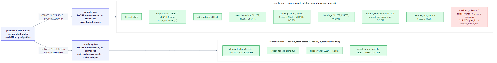

### 3.5 Migrations

| File | Content |
|---|---|
| `001_core_schema.sql` | extensions (`btree_gist`, `citext`), enums, `is_valid_timezone`, all core tables, CHECKs, exclusion constraint, indexes, plan seed |
| `002_row_level_security.sql` | `current_org_id()`, RLS + FORCE + tenant policies, grants |
| `003_booking_write_serialization.sql` | per-room advisory-lock trigger |
| `004_billing.sql` | `stripe_events`, `subscriptions.last_event_at`, column-level UPDATE grant on organizations |
| `005_calendar_sync.sql` | `google_connections`, `calendar_sync_outbox`, enqueue trigger, RLS, grants |
| `006_socket_io_adapter.sql` | `socket_io_attachments` |
| `007_system_role_policies.sql` | `system_access` policies (replaces reliance on BYPASSRLS) |

---

## 4. Request handling

### 4.1 Middleware pipeline

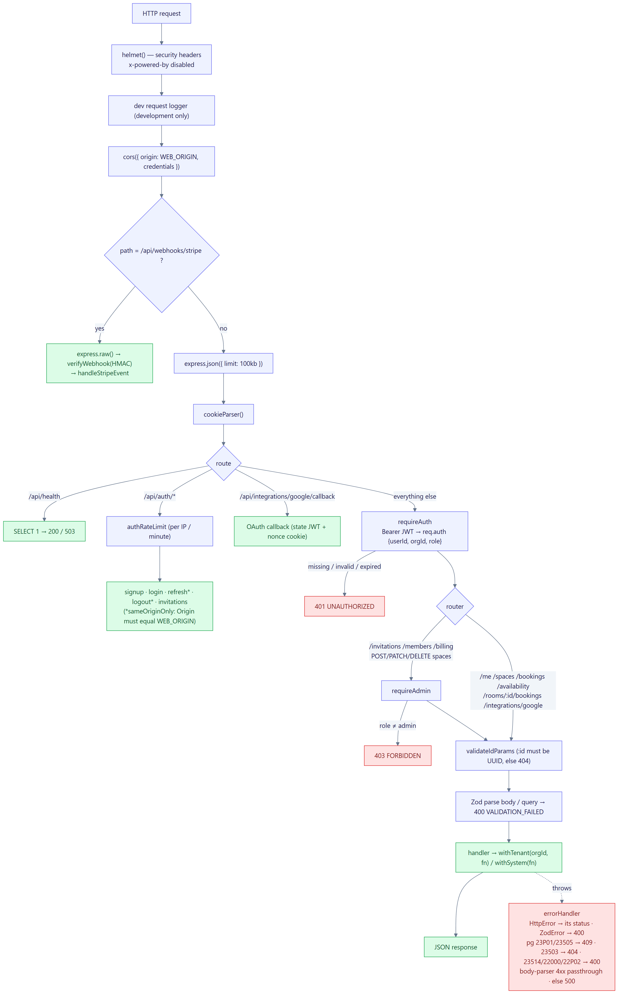

### 4.2 Tenant-scoped transactions

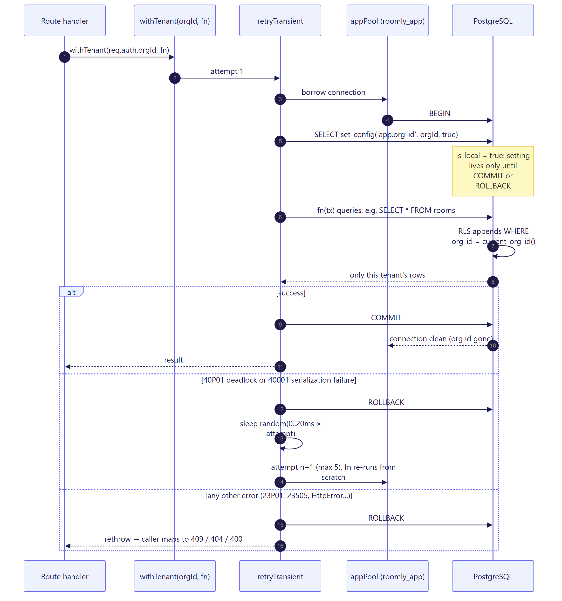

```ts
withTenant(orgId, fn)   // appPool (roomly_app, max 20) → BEGIN; set_config('app.org_id', orgId, true); fn(tx); COMMIT
withSystem(fn)          // systemPool (roomly_system, max 5) → BEGIN; fn(tx); COMMIT
retryTransient(fn, 5)   // retries on 40P01 / 40001 with jittered backoff; fn must be re-runnable
```

### 4.3 Error mapping

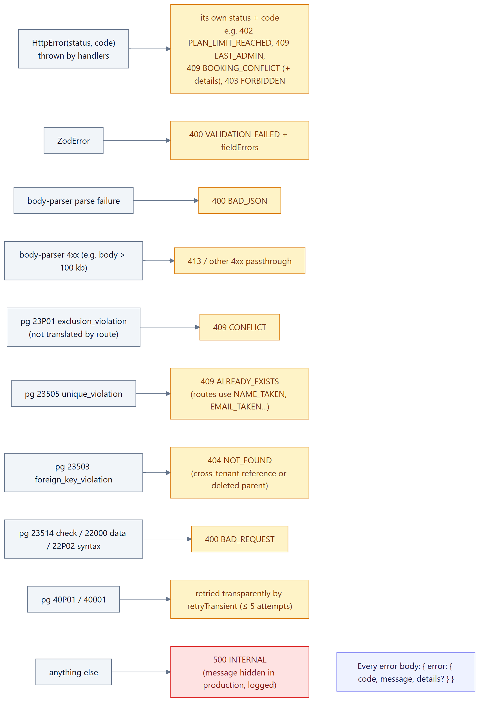

---

## 5. Booking engine

### 5.1 Create booking: sequence

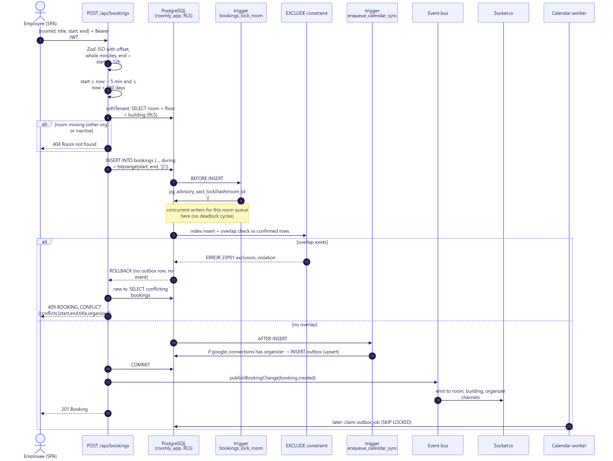

**Validation (Zod, `createBookingSchema`):** `roomId` uuid; `title` 1–200 trimmed; `start` and `end` ISO with offset, whole minutes, `end > start`, duration ≤ 12 h. **Server checks:** start ≥ now − 5 min (grace for "book now"), start ≤ now + 180 days, and the room is visible and active.

### 5.2 Why this is race-free

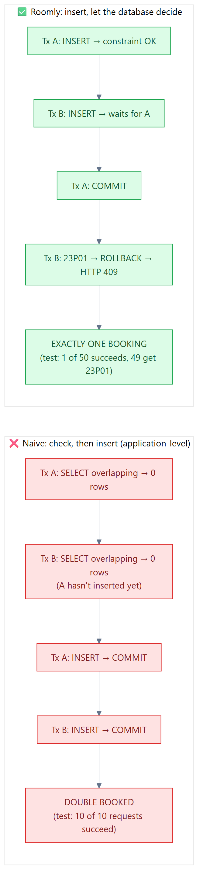

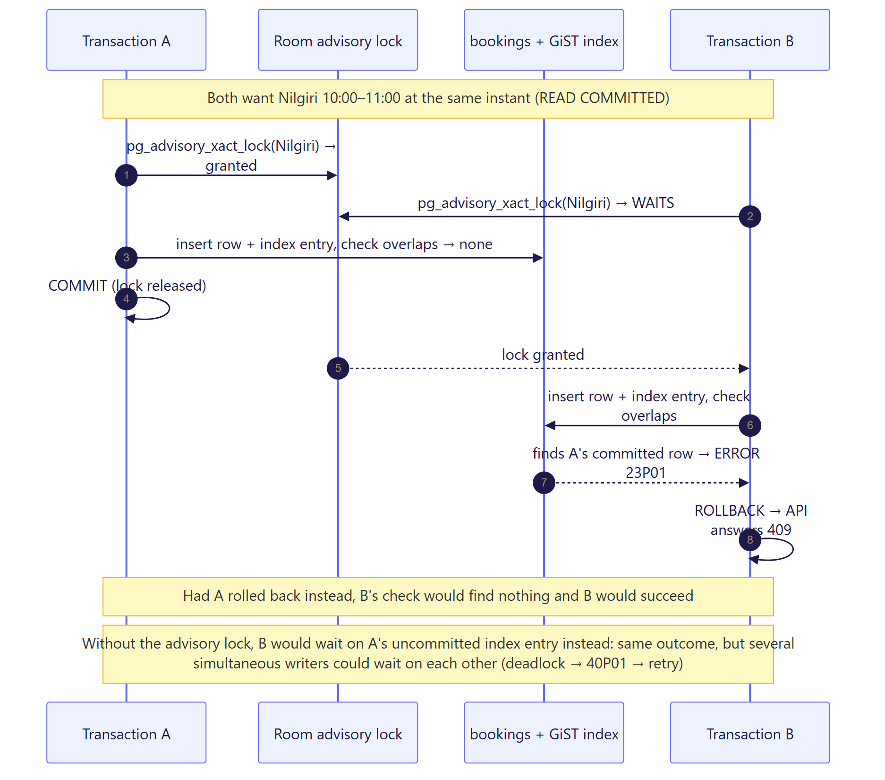

### 5.3 Deadlocks and the per-room lock

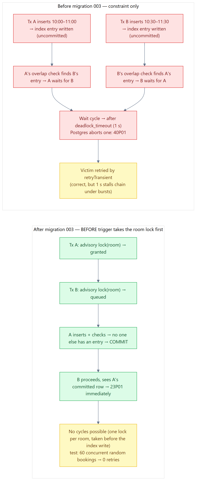

### 5.4 Booking lifecycle

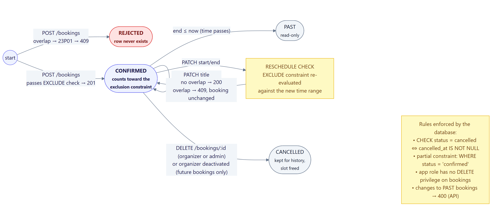

### 5.5 Reschedule and cancel

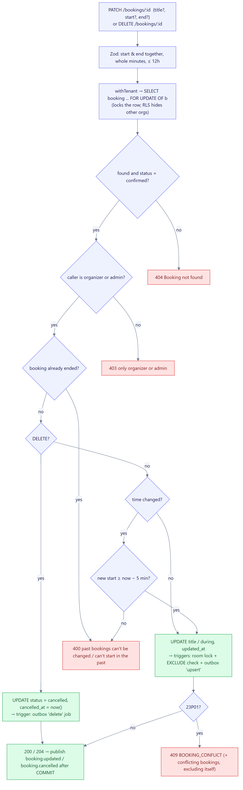

The row is locked with `FOR UPDATE OF b` while it is checked and updated. When a reschedule fails with `23P01`, the conflict lookup excludes the booking itself, so extending a meeting inside its own old range succeeds.

### 5.6 Read queries

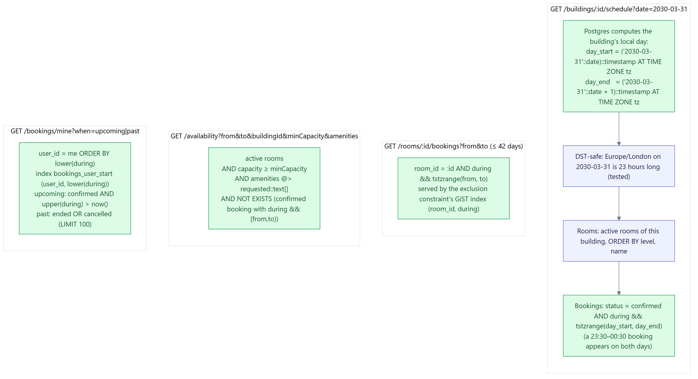

### 5.7 Time-zone handling

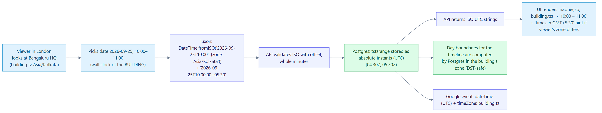

### 5.8 Booking payload

```ts
interface Booking {
  id: string; roomId: string; title: string;
  start: string; end: string;               // ISO UTC
  status: 'confirmed' | 'cancelled';
  organizer: { id: string; name: string };
  isMine: boolean;                          // organizer === caller
  canManage: boolean;                       // isMine || caller is admin
}
// 409 details: { conflicts: [{ start, end, title, organizerName }] }
```

---

## 6. Authentication and sessions

### 6.1 Tokens

| Token | Format | Lifetime | Storage | Sent as |
|---|---|---|---|---|
| Access | JWT HS256, `{sub: userId, org, role}`, `iss=roomly`, `aud=roomly-api` | 15 min | SPA memory only | `Authorization: Bearer` |
| Refresh | 32 random bytes, base64url | 30 days, **single-use** | DB: SHA-256 hash; browser: cookie `roomly_rt` (`HttpOnly`, `SameSite=Strict`, `Path=/api/auth`, `Secure` in prod) | cookie |
| Invitation | 32 random bytes | 7 days, single-use | DB: SHA-256 hash | URL path `/invite/:token` |
| OAuth state | JWT HS256 `{sub, org, nonce}`, `aud=google-oauth` | 10 min | URL + nonce cookie `roomly_google_nonce` | query string |

Hashing: passwords use **argon2id** (memory 19456 KiB, time 2, parallelism 1). Random tokens use SHA-256, which is enough for high-entropy values.

### 6.2 Signup and login

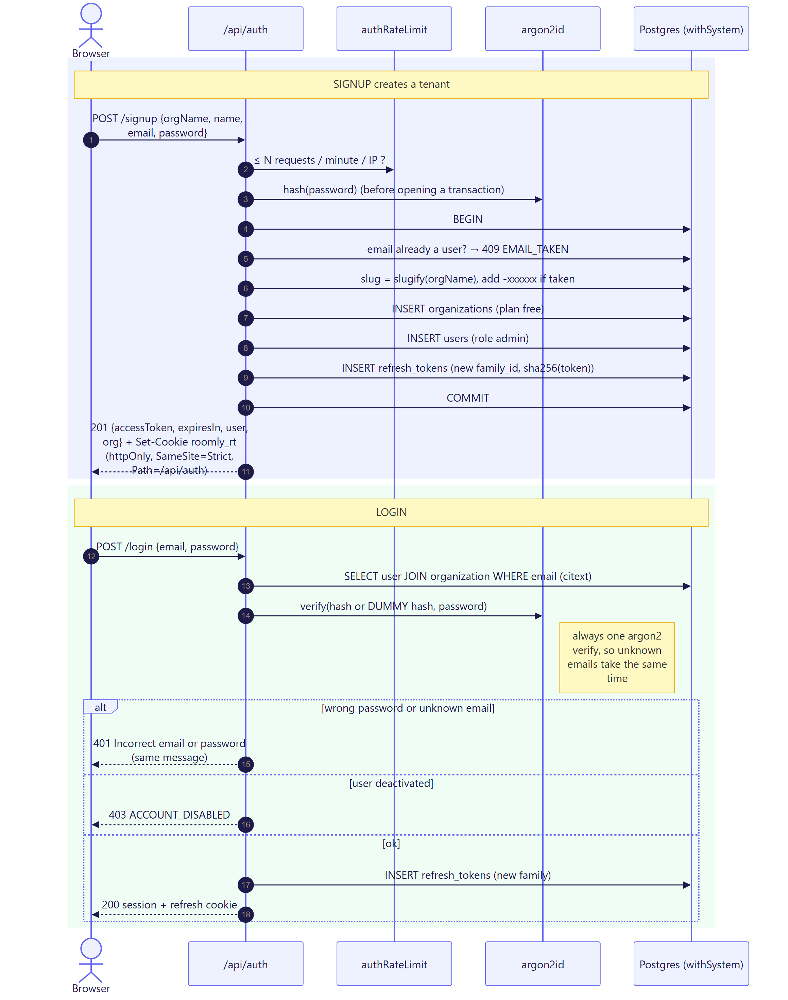

### 6.3 Refresh rotation and reuse detection

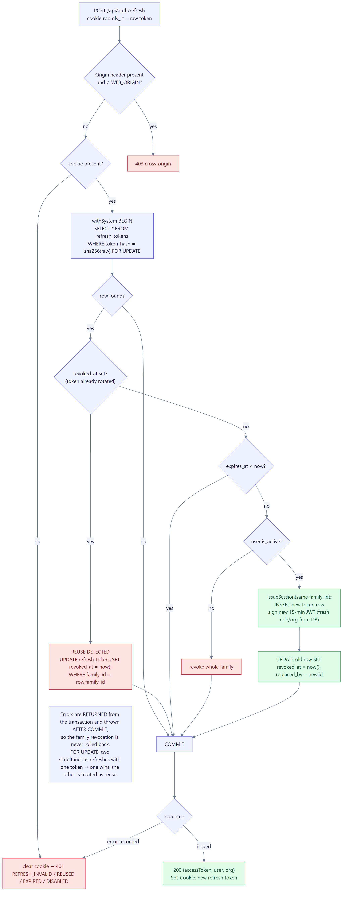

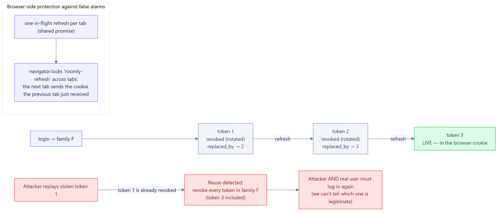

### 6.4 Invitations

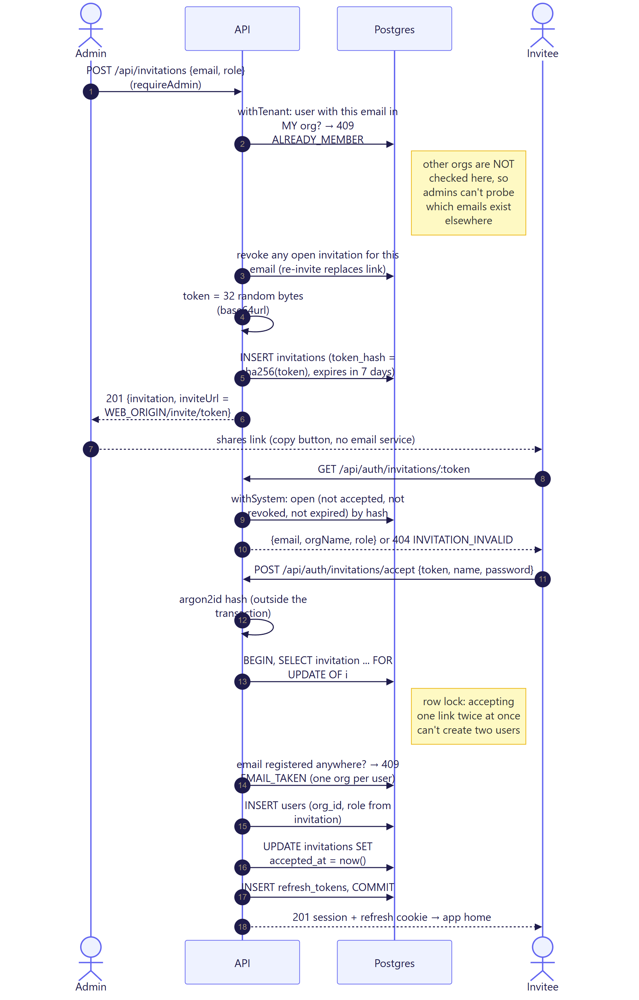

### 6.5 Logout and deactivation

- **Logout** revokes the presented token's whole family (this device's session chain) and clears the cookie.
- **Deactivation** (§7.2) revokes all of the user's tokens and cancels their future bookings.
- `/api/me` and the socket handshake both require `is_active`.

---

## 7. Spaces, plan limits and team management

### 7.1 Room cap (plan limit)

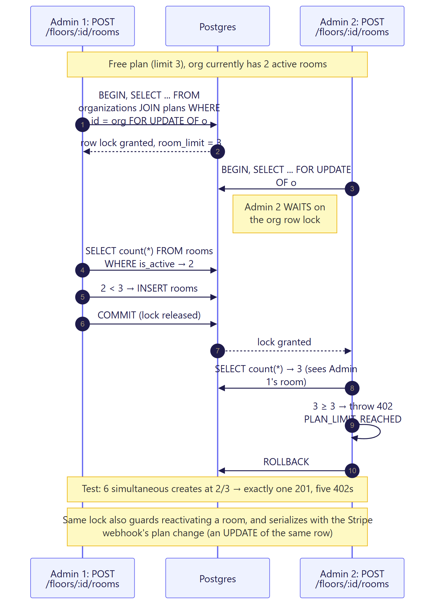

Applies to room creation **and** reactivation. On failure the API returns `402 PLAN_LIMIT_REACHED`, with `details = {planId, planName, roomLimit, activeRooms}`.

Deleting a building, floor or room that has booking history fails the `RESTRICT` foreign key and returns `409 HAS_BOOKINGS` ("deactivate instead").

### 7.2 Member updates and the last-admin invariant

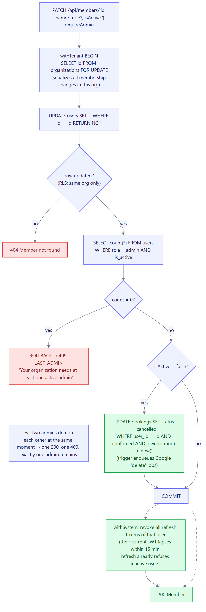

---

## 8. Real-time layer

### 8.1 Handshake, subscribe and presence

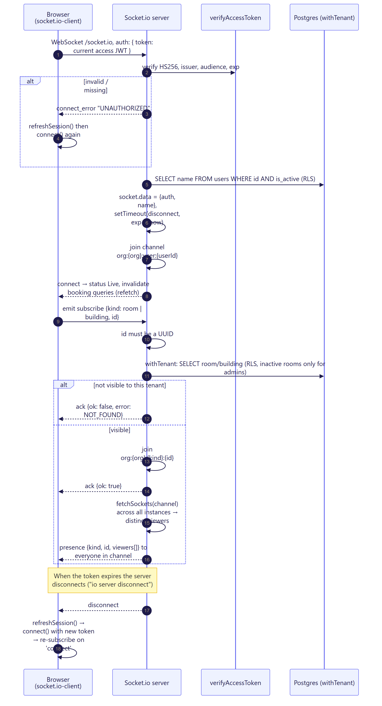

**Channel names:** `org:{orgId}:room:{roomId}`, `org:{orgId}:building:{buildingId}`, `org:{orgId}:user:{userId}`.

**Contract** (`packages/shared/src/realtime.ts`):

```ts
// client → server
subscribe(req: { kind: 'room' | 'building'; id: string }, ack: (res: { ok: true } | { ok: false; error: string }) => void)
unsubscribe(req: { kind; id })
// server → client
'booking.changed': { type: 'booking.created' | 'booking.updated' | 'booking.cancelled'; roomId; buildingId; bookingId; actorId }
'presence':        { kind; id; viewers: { id; name }[] }
```

### 8.2 Fan-out across instances

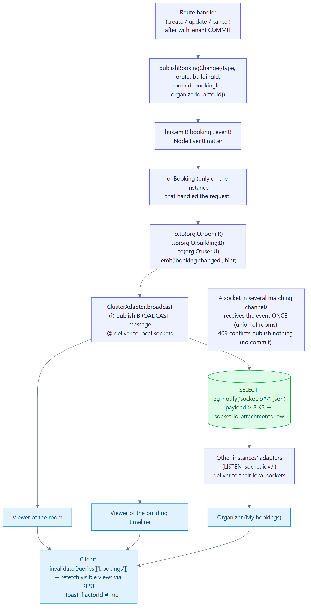

### 8.3 Client connection states

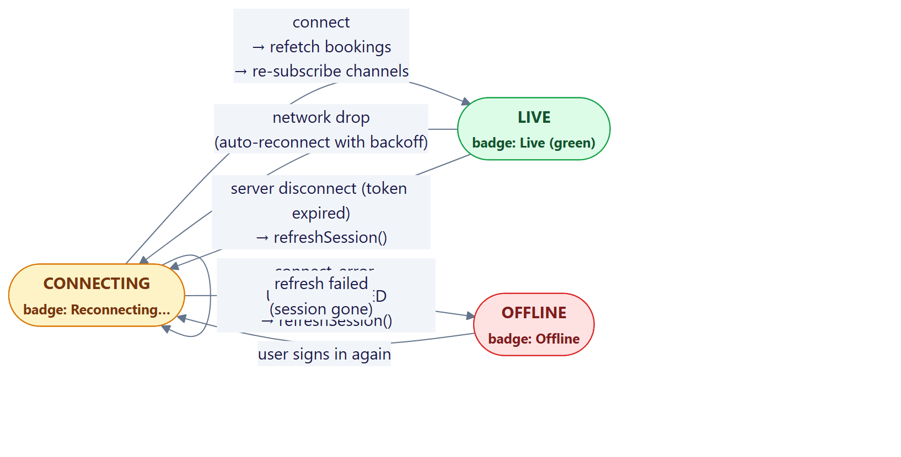

---

## 9. Billing (Stripe)

### 9.1 Checkout and portal

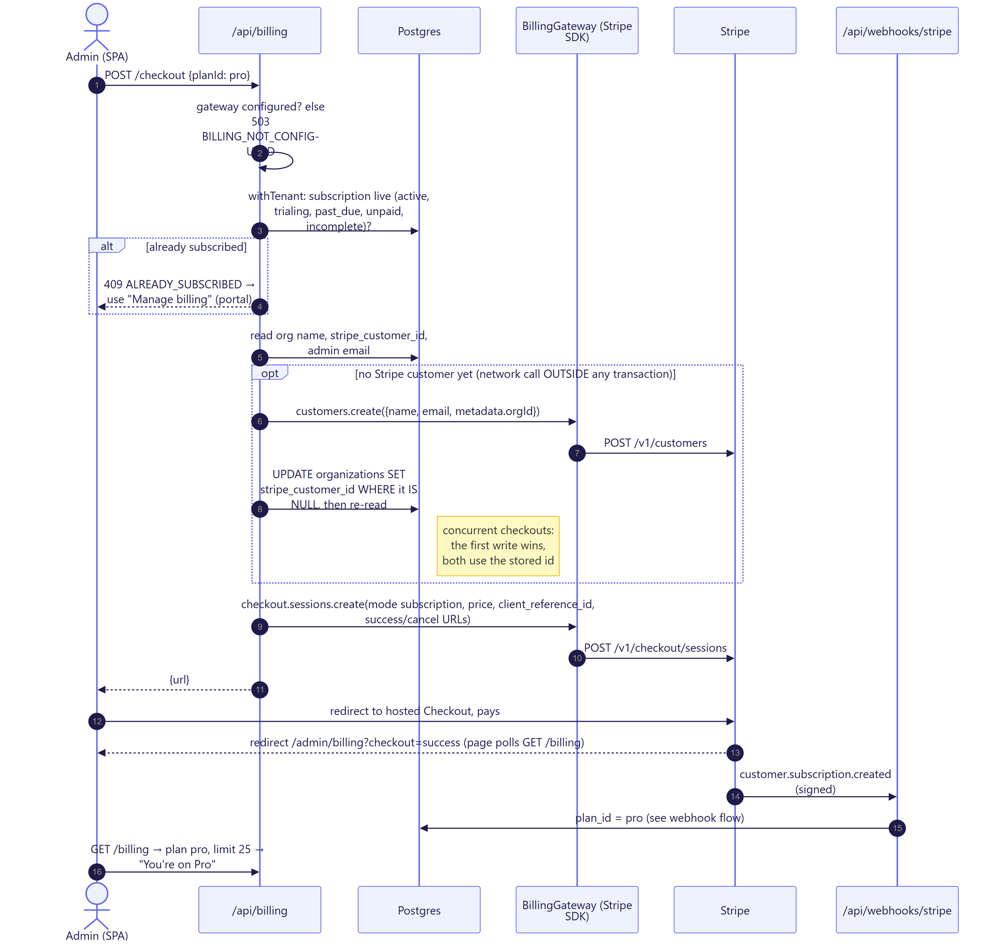

All Stripe API calls go through the `BillingGateway` interface (`createCustomer`, `createCheckoutSession`, `createPortalSession`). Tests replace it with a stub. When `STRIPE_SECRET_KEY` is absent, `billing.gateway` is `null` and billing endpoints return `503 BILLING_NOT_CONFIGURED`.

### 9.2 Webhook processing

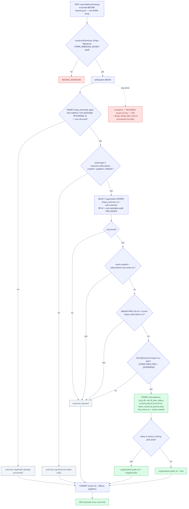

### 9.3 Subscription status → plan

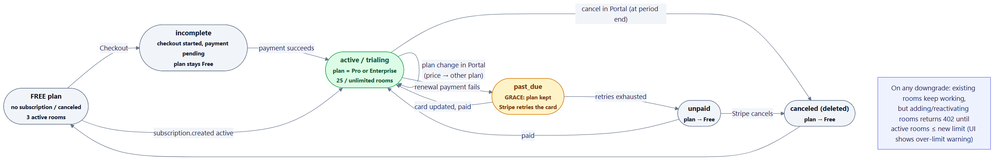

| Stripe status | Effective plan |
|---|---|
| active, trialing | mapped plan |
| past_due | mapped plan (grace period) |
| incomplete, incomplete_expired, unpaid, paused | free |
| deleted event (canceled) | free |

---

## 10. Google Calendar sync

### 10.1 Connecting (OAuth 2.0 authorization code)

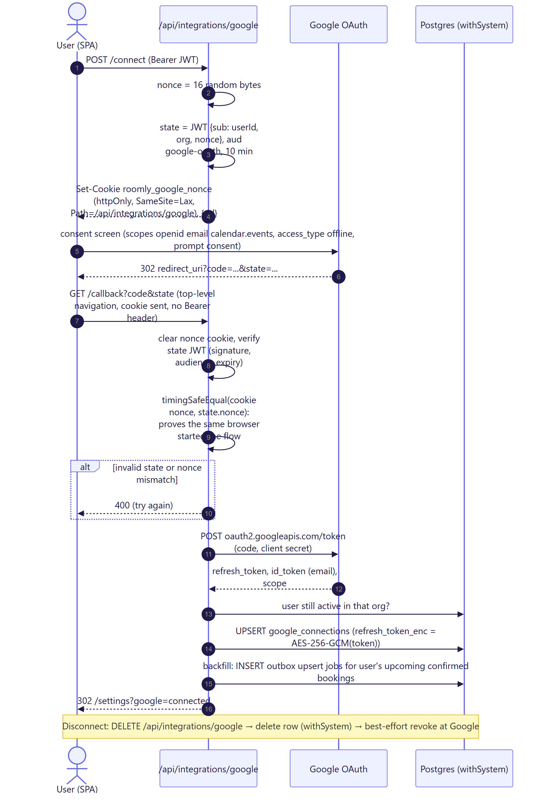

**Token encryption** (`integrations/crypto.ts`): AES-256-GCM with a 12-byte random IV per encryption. Stored as `v1.<iv>.<tag>.<ciphertext>` (base64url). The key is `TOKEN_ENCRYPTION_KEY` (32 bytes, base64). A tampered ciphertext fails authentication instead of decrypting to garbage.

### 10.2 Google client

`GoogleClient` interface: `authUrl`, `exchangeCode`, `accessToken`, `upsertEvent`, `deleteEvent`, `revoke`. It is implemented with plain `fetch` against Google's REST endpoints, and replaced by a stub in tests.

**Deterministic event id:** `rb` + booking UUID without dashes. That is a valid base32hex id (characters 0-9, a-v), so every retry targets the same event and no duplicates can be created.

**Upsert:** `PUT /events/{id}` (this also restores an event we previously deleted); on `404` → `POST /events` with the id. **Delete:** `DELETE`, treating `404` and `410` as success.

**Event body:** `summary` = title, `location` = "Room (Floor), Building, Address", `description` = "Meeting room booked by {organizer} via Roomly.", `start`/`end` = `{ dateTime: ISO UTC, timeZone: building tz }`.

### 10.3 Outbox trigger

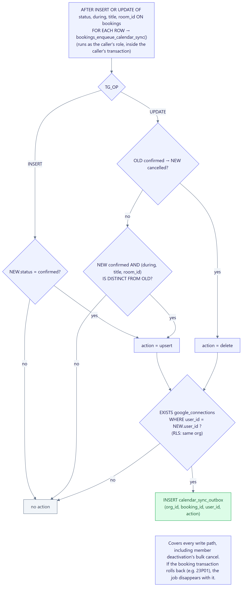

### 10.4 Worker

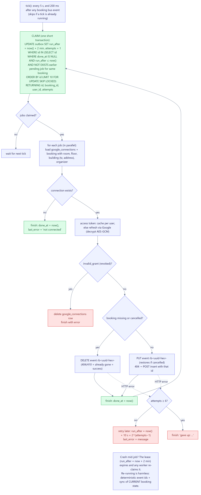

### 10.5 Job states

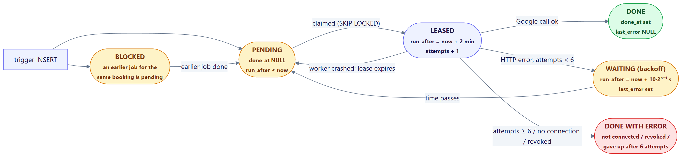

---

## 11. Frontend

### 11.1 Routes and component tree

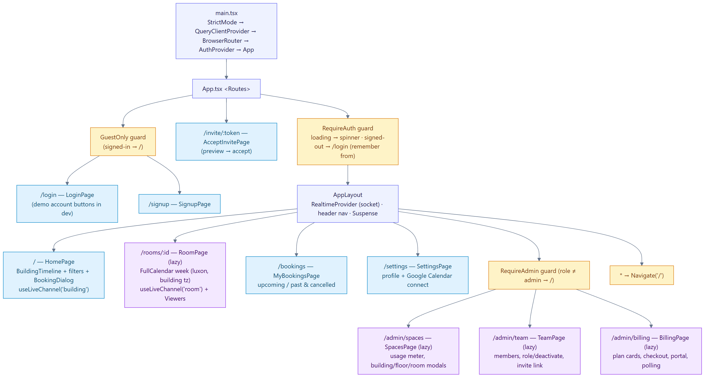

### 11.2 Data fetching, auth and caching

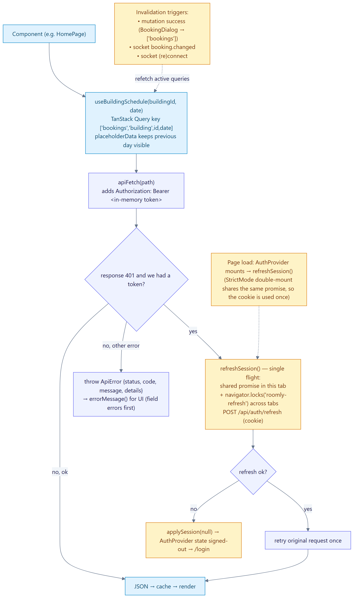

**Query keys:**

| Key | Source |
|---|---|
| `['spaces']` | GET /spaces |
| `['plan-usage']` | GET /plan-usage |
| `['members']`, `['invitations']` | admin lists |
| `['bookings','building',id,date]` | building schedule |
| `['bookings','room',id,from,to]` | room calendar |
| `['bookings','mine',when]` | my bookings |
| `['billing']`, `['google-status']` | billing overview, Google status (both poll while something is pending) |

Every booking view shares the `['bookings']` prefix, so a single `invalidateQueries({ queryKey: ['bookings'] })` refreshes everything visible.

**Key components:**
- `BuildingTimeline`: 30-minute cells positioned on the building's wall clock, a "now" line, widening to include out-of-hours bookings.
- `BookingDialog`: create, edit and cancel, conflict display, 15-minute pickers, midnight end handling.
- `RoomPage`: FullCalendar `timeGridWeek` with the Luxon time-zone plugin, drag-select to book.
- `LiveIndicators`: live badge and viewer avatars.

---

## 12. API reference

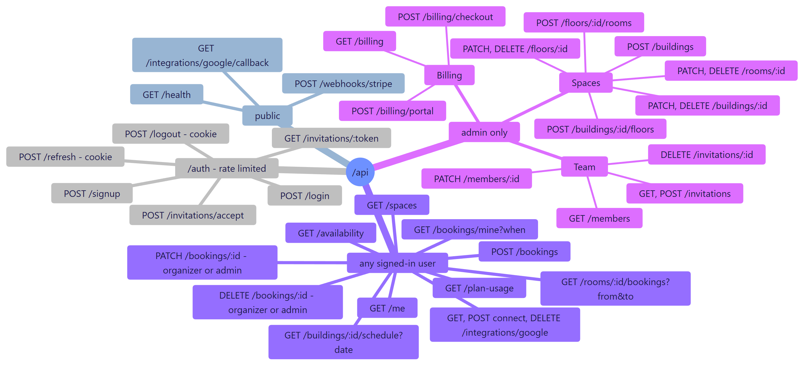

| Method & path | Auth | Request | Success | Notable errors |
|---|---|---|---|---|
| GET /health | – | – | 200 `{ok}` | 503 |
| POST /auth/signup | rate-limited | `{orgName, name, email, password}` | 201 AuthSession + cookie | 400, 409 EMAIL_TAKEN, 429 |
| POST /auth/login | rate-limited | `{email, password}` | 200 AuthSession + cookie | 401, 403 ACCOUNT_DISABLED, 429 |
| POST /auth/refresh | cookie, same-origin | – | 200 AuthSession + new cookie | 401 REFRESH_*, 403 |
| POST /auth/logout | cookie, same-origin | – | 204 | |
| GET /auth/invitations/:token | – | – | 200 `{email, orgName, role}` | 404 INVITATION_INVALID |
| POST /auth/invitations/accept | – | `{token, name, password}` | 201 AuthSession | 404, 409 EMAIL_TAKEN |
| GET /me | user | – | `{user, org}` | 401, 404 |
| GET /spaces | user | – | Building[] (inactive rooms for admins only) | |
| GET /plan-usage | user | – | PlanUsage | |
| POST /buildings | admin | `{name, address?, timezone}` | 201 Building | 400, 409 NAME_TAKEN |
| PATCH / DELETE /buildings/:id | admin | partial | 200 / 204 | 404, 409 HAS_BOOKINGS |
| POST /buildings/:id/floors | admin | `{name, level}` | 201 Floor | 404, 409 LEVEL_TAKEN |
| PATCH / DELETE /floors/:id | admin | partial | 200 / 204 | 404, 409 |
| POST /floors/:id/rooms | admin | `{name, capacity, amenities[]}` | 201 Room | 402 PLAN_LIMIT_REACHED, 404, 409 NAME_TAKEN |
| PATCH /rooms/:id | admin | partial + `isActive` | 200 Room | 402 (reactivation), 404 |
| DELETE /rooms/:id | admin | – | 204 | 404, 409 HAS_BOOKINGS |
| GET /buildings/:id/schedule?date=YYYY-MM-DD | user | – | BuildingSchedule | 400, 404 |
| GET /rooms/:id/bookings?from&to | user | ≤ 42 days | RoomSchedule | 400, 404 |
| GET /availability?from&to&buildingId&minCapacity&amenities | user | – | AvailableRoom[] | 400 |
| GET /bookings/mine?when=upcoming\|past | user | – | MyBooking[] (≤ 100) | |
| POST /bookings | user | `{roomId, title, start, end}` | 201 Booking | 400, 404, 409 BOOKING_CONFLICT |
| PATCH /bookings/:id | organizer/admin | `{title?, start?, end?}` | 200 Booking | 400, 403, 404, 409 |
| DELETE /bookings/:id | organizer/admin | – | 204 (soft cancel) | 400, 403, 404 |
| GET/POST/DELETE /invitations[/:id] | admin | `{email, role}` | list / 201 `{invitation, inviteUrl}` / 204 | 409 ALREADY_MEMBER |
| GET /members, PATCH /members/:id | admin | `{name?, role?, isActive?}` | Member[] / Member | 404, 409 LAST_ADMIN |
| GET /billing | admin | – | BillingOverview | |
| POST /billing/checkout | admin | `{planId: pro\|enterprise}` | `{url}` | 409 ALREADY_SUBSCRIBED, 503 |
| POST /billing/portal | admin | – | `{url}` | 409 NO_CUSTOMER, 503 |
| POST /webhooks/stripe | Stripe signature | raw event | 200 `{received, outcome}` | 400 BAD_SIGNATURE, 500 → retried |
| GET /integrations/google | user | – | status | |
| POST /integrations/google/connect | user | – | `{url}` + nonce cookie | 503 GOOGLE_NOT_CONFIGURED |
| GET /integrations/google/callback | state + nonce | `code, state` | 302 /settings?google=… | 400 |
| DELETE /integrations/google | user | – | 204 | |

---

## 13. Error catalogue

| HTTP | Code | Raised when |
|---|---|---|
| 400 | VALIDATION_FAILED | Zod validation failed (`details` = flattened field errors) |
| 400 | BAD_JSON / BAD_REQUEST | malformed JSON / invalid values or business rule (past booking, range too long) |
| 401 | UNAUTHORIZED | missing, invalid or expired access token |
| 401 | REFRESH_INVALID / REUSED / EXPIRED / DISABLED | refresh failed (cookie cleared) |
| 402 | PLAN_LIMIT_REACHED | adding or reactivating a room would exceed the plan |
| 403 | FORBIDDEN | role or ownership check failed, or cross-origin refresh |
| 403 | ACCOUNT_DISABLED | login by a deactivated user |
| 404 | NOT_FOUND | missing, malformed or other-tenant id |
| 404 | INVITATION_INVALID | invite token unknown, expired, revoked or used |
| 409 | BOOKING_CONFLICT | exclusion constraint violated (`details.conflicts`) |
| 409 | EMAIL_TAKEN / ALREADY_MEMBER / NAME_TAKEN / LEVEL_TAKEN | uniqueness rules |
| 409 | HAS_BOOKINGS | delete blocked by booking history |
| 409 | LAST_ADMIN | change would leave no active admin |
| 409 | ALREADY_SUBSCRIBED / NO_CUSTOMER | billing state rules |
| 413 | BAD_REQUEST | body > 100 KB |
| 429 | RATE_LIMITED | auth endpoint limit exceeded |
| 503 | BILLING_NOT_CONFIGURED / GOOGLE_NOT_CONFIGURED | integration keys absent |
| 500 | INTERNAL | unexpected (message hidden in production) |

---

## 14. Configuration reference

| Variable | Default (dev) | Purpose |
|---|---|---|
| PGHOST / PGPORT | localhost / 5433 | database endpoint |
| PG_SUPERUSER / PG_SUPERUSER_PASSWORD | postgres / postgres | migrations and dev tooling only |
| DB_NAME / TEST_DB_NAME | roomly / roomly_test | databases |
| APP_DB_USER / APP_DB_PASSWORD | roomly_app | tenant request role |
| SYSTEM_DB_USER / SYSTEM_DB_PASSWORD | roomly_system | privileged role |
| API_PORT | 4000 | |
| WEB_ORIGIN | http://localhost:5173 | CORS, Origin check, redirect URLs |
| JWT_SECRET | dev placeholder (refused in prod) | HS256 key for access tokens and OAuth state |
| ACCESS_TOKEN_TTL_SECONDS | 900 | |
| REFRESH_TOKEN_TTL_DAYS | 30 | |
| INVITE_TTL_DAYS | 7 | |
| STRIPE_SECRET_KEY / STRIPE_WEBHOOK_SECRET | empty | billing (optional) |
| STRIPE_PRICE_PRO / STRIPE_PRICE_ENTERPRISE | empty | plan ↔ price mapping |
| GOOGLE_CLIENT_ID / GOOGLE_CLIENT_SECRET | empty | calendar sync (optional) |
| GOOGLE_REDIRECT_URI | http://localhost:5173/api/integrations/google/callback | |
| TOKEN_ENCRYPTION_KEY | dev placeholder (refused in prod) | AES-256-GCM key, 32 bytes base64 |
| RATE_LIMIT_AUTH_PER_MINUTE | 20 | per IP |
| MIGRATIONS_DIR | `<repo>/db/migrations` | override inside the container |
| PGSSLMODE (+ NODE_EXTRA_CA_CERTS) | – | TLS to RDS |

---

## 15. Process lifecycle, migrations and tooling

### 15.1 API process startup and shutdown

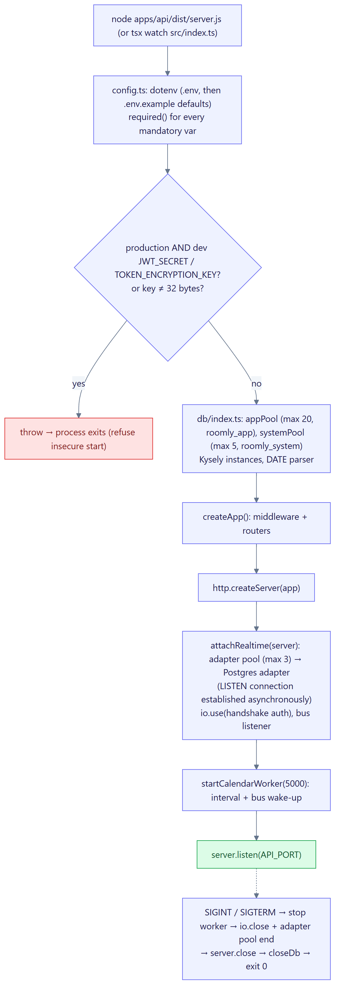

### 15.2 Database lifecycle and migrations

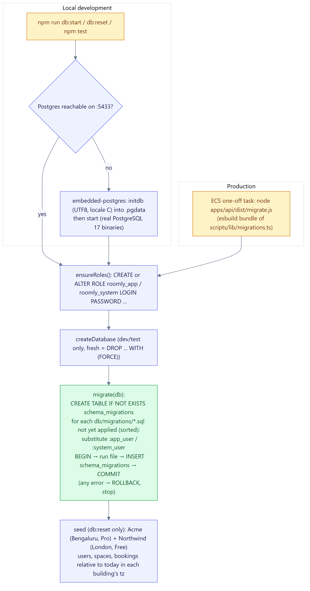

---

## 16. Testing

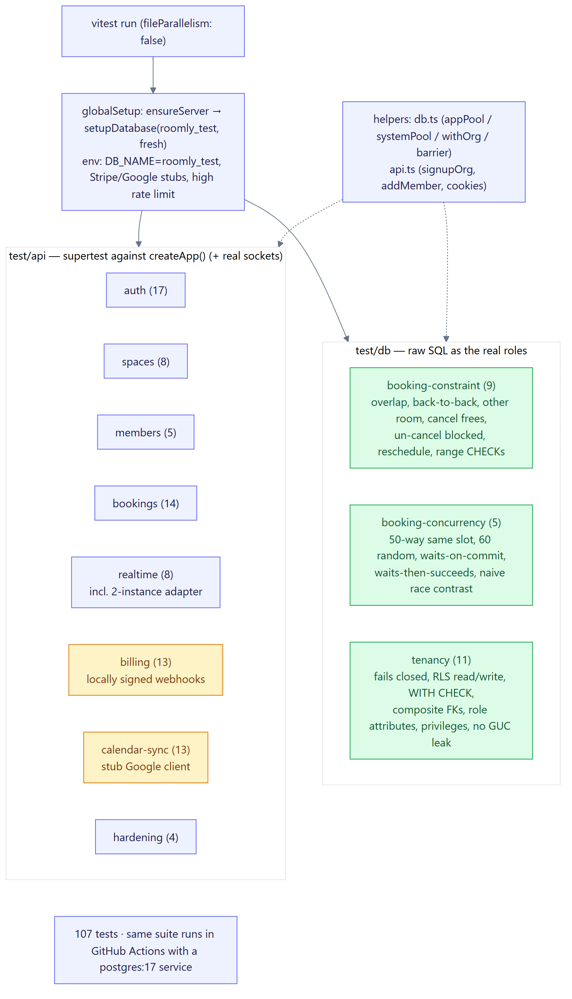

**Principles:**
- Real PostgreSQL, never mocks: the features under test *are* database behaviour.
- Database tests connect as the **real application roles**, so RLS and grants are exercised exactly as in production.
- Concurrency tests use a **barrier** so that N transactions issue their statement at the same moment.
- External providers are replaced at their seam: `BillingGateway`, `GoogleClient`, and locally signed Stripe events.
- Every test run recreates `roomly_test` from the migrations, so tests can't depend on leftover state.

| Suite | Tests | Highlights |
|---|---|---|
| db/booking-constraint | 9 | overlap, back-to-back, other room, cancel frees slot, un-cancel blocked, reschedule, range CHECKs |
| db/booking-concurrency | 5 | 50-way same slot → 1 winner, 60 random → 0 overlaps and 0 retries, wait semantics, naive race contrast |
| db/tenancy | 11 | fails closed, isolation, WITH CHECK, composite FKs, role attributes, privileges, no GUC leak |
| api/auth | 17 | cookie flags, duplicate email, timing-safe login messages, forged/expired JWT, rotation, reuse, concurrent refresh, Origin check, invitations |
| api/spaces | 8 | CRUD, inactive rooms hidden, 404 across tenants, HAS_BOOKINGS, room cap incl. concurrent creates |
| api/members | 5 | last-admin incl. mutual demotion race, deactivation side effects |
| api/bookings | 14 | 409 with details, 20 concurrent HTTP requests, validation, offsets, DST day, availability filters, post-commit events |
| api/realtime | 8 | handshake, expiry disconnect, channel isolation, fan-out, no event on 409, personal channel, two-instance adapter, presence |
| api/billing | 13 | signature, idempotency, ordering, grace, replaced subscriptions, downgrade, webhook-only plan changes, checkout/portal |
| api/calendar-sync | 13 | encryption, OAuth state/nonce, backfill, trigger coverage, retries, revocation, ordering, SKIP LOCKED |
| api/hardening | 4 | rate limit, health, headers, 413/400 |
| **Total** | **107** | also run in GitHub Actions against `postgres:17` |
